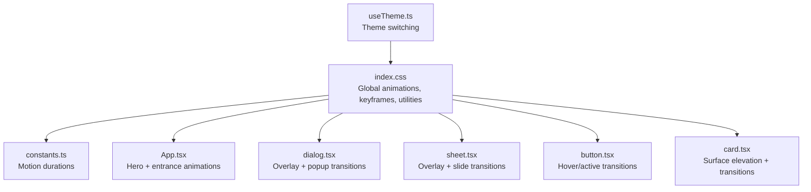
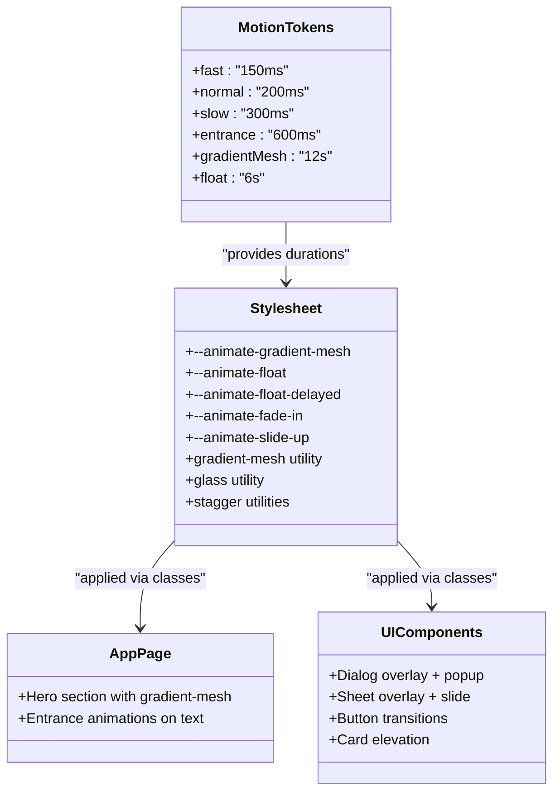
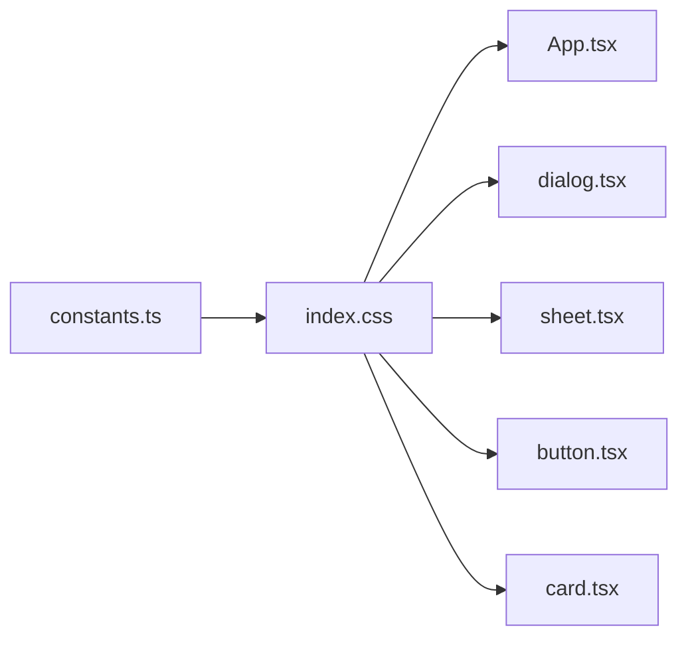

# Animation and Visual Effects

<cite>
**Referenced Files in This Document**
- [index.css](file://src/index.css)
- [constants.ts](file://src/lib/constants.ts)
- [App.tsx](file://src/App.tsx)
- [useTheme.ts](file://src/hooks/useTheme.ts)
- [dialog.tsx](file://src/components/ui/dialog.tsx)
- [sheet.tsx](file://src/components/ui/sheet.tsx)
- [button.tsx](file://src/components/ui/button.tsx)
- [card.tsx](file://src/components/ui/card.tsx)
</cite>

## Table of Contents
1. [Introduction](#introduction)
2. [Project Structure](#project-structure)
3. [Core Components](#core-components)
4. [Architecture Overview](#architecture-overview)
5. [Detailed Component Analysis](#detailed-component-analysis)
6. [Dependency Analysis](#dependency-analysis)
7. [Performance Considerations](#performance-considerations)
8. [Troubleshooting Guide](#troubleshooting-guide)
9. [Conclusion](#conclusion)
10. [Appendices](#appendices)

## Introduction
This document describes the animation and visual effects system for RedRep, focusing on the “Scholarly Neon” design identity. It explains the five defined animation durations, the gradient mesh background, glass morphism, entrance animations, floating decorative effects, CSS keyframe integration, performance optimizations, accessibility considerations, and guidelines for extending the system consistently.

## Project Structure
The animation system is primarily defined in the global stylesheet and constants, then applied across components and pages:
- Global animations and keyframes live in the stylesheet.
- Duration tokens are centralized in constants.
- Components and pages consume utility classes and tokens to apply motion consistently.

**Diagram sources**
- [index.css:11-89](file://src/index.css#L11-L89)
- [constants.ts:23-31](file://src/lib/constants.ts#L23-L31)
- [App.tsx:26-44](file://src/App.tsx#L26-L44)
- [dialog.tsx:26-80](file://src/components/ui/dialog.tsx#L26-L80)
- [sheet.tsx:24-78](file://src/components/ui/sheet.tsx#L24-L78)
- [button.tsx:6-58](file://src/components/ui/button.tsx#L6-L58)
- [card.tsx:5-103](file://src/components/ui/card.tsx#L5-L103)
- [useTheme.ts:19-69](file://src/hooks/useTheme.ts#L19-L69)

**Section sources**
- [index.css:11-89](file://src/index.css#L11-L89)
- [constants.ts:23-31](file://src/lib/constants.ts#L23-L31)
- [App.tsx:26-44](file://src/App.tsx#L26-L44)
- [dialog.tsx:26-80](file://src/components/ui/dialog.tsx#L26-L80)
- [sheet.tsx:24-78](file://src/components/ui/sheet.tsx#L24-L78)
- [button.tsx:6-58](file://src/components/ui/button.tsx#L6-L58)
- [card.tsx:5-103](file://src/components/ui/card.tsx#L5-L103)
- [useTheme.ts:19-69](file://src/hooks/useTheme.ts#L19-L69)

## Core Components
- Motion durations: fast, normal, slow, entrance, gradient mesh, float.
- Entrance animations: fade-in, slide-up.
- Decorative animations: float, float-delayed.
- Surface and backdrop utilities: gradient mesh background, glass morphism, surface elevation.
- Stagger delays for multi-element sequences.

**Section sources**
- [constants.ts:23-31](file://src/lib/constants.ts#L23-L31)
- [index.css:54-88](file://src/index.css#L54-L88)
- [index.css:285-326](file://src/index.css#L285-L326)
- [index.css:385-391](file://src/index.css#L385-L391)

## Architecture Overview
The motion system is built around:
- Tokenized durations in constants.
- CSS variables for animations and keyframes.
- Utility classes for reusable effects.
- Component-level composition of entrance and interaction animations.

**Diagram sources**
- [constants.ts:23-31](file://src/lib/constants.ts#L23-L31)
- [index.css:54-88](file://src/index.css#L54-L88)
- [index.css:285-326](file://src/index.css#L285-L326)
- [App.tsx:26-44](file://src/App.tsx#L26-L44)
- [dialog.tsx:26-80](file://src/components/ui/dialog.tsx#L26-L80)
- [sheet.tsx:24-78](file://src/components/ui/sheet.tsx#L24-L78)
- [button.tsx:6-58](file://src/components/ui/button.tsx#L6-L58)
- [card.tsx:5-103](file://src/components/ui/card.tsx#L5-L103)

## Detailed Component Analysis

### Motion Duration Tokens
- fast: 150ms — micro-interactions, quick toggles.
- normal: 200ms — standard hover/active feedback.
- slow: 300ms — subtle transitions where extra time improves perception.
- entrance: 600ms — page/component entry timing.
- gradientMesh: 12s — long-running background animation.
- float: 6s — decorative element oscillation.

Guidelines:
- Use fast for immediate feedback (e.g., button press).
- Use normal for hover states and minor state changes.
- Use slow for content reflows or heavy updates.
- Use entrance for first paint or route transitions.
- Keep gradientMesh and float durations consistent across similar backgrounds and floating elements.

**Section sources**
- [constants.ts:23-31](file://src/lib/constants.ts#L23-L31)

### Gradient Mesh Background
- Implements a continuously shifting multi-stop linear gradient with background-size animation.
- Provides light and dark variants with adjusted opacities and stops.
- Applied via a utility class on hero and other sections.

Implementation highlights:
- Uses oklch color tokens for brand and accent harmony.
- Animates background-position to create a flowing mesh effect.
- Backed by a CSS variable for duration and easing.

Usage:
- Apply the utility class to containers requiring a dynamic background.
- Combine with a low opacity and optional grain overlay for texture.

**Section sources**
- [index.css:285-311](file://src/index.css#L285-L311)

### Glass Morphism Effects
- Achieved with a semi-transparent surface, strong backdrop blur, and thin border.
- Includes light and dark variants with tuned blur and saturation.
- Provides elevated surface depth and readability.

Implementation highlights:
- backdrop-filter with vendor prefixes for compatibility.
- Border with alpha blending for edge softness.
- Utility class encapsulates the recipe for reuse.

Usage:
- Apply to overlays, modals, toolbars, and floating panels.
- Pair with appropriate z-index and container sizing.

**Section sources**
- [index.css:328-341](file://src/index.css#L328-L341)

### Entrance Animations
- Fade-in: increases opacity from 0 to 1.
- Slide-up: fades in and lifts from a displaced baseline.
- Both use the same duration token for consistent pacing.

Application examples:
- Hero headline uses a fade-in.
- Hero subheadings use slide-up with stagger delays.

Staggering:
- Stagger utilities add incremental delays for sequential appearance.

**Section sources**
- [index.css:75-83](file://src/index.css#L75-L83)
- [App.tsx:34-42](file://src/App.tsx#L34-L42)
- [index.css:385-391](file://src/index.css#L385-L391)

### Floating Animation System
- Float animation gently translates vertically and rotates slightly to imply life.
- Delayed variant offsets the phase for layered floating elements.
- Useful for decorative accents, floating action buttons, or animated illustrations.

Integration:
- Apply the float animation class to elements.
- Use delayed variant for staggered floating effects.

**Section sources**
- [index.css:69-73](file://src/index.css#L69-L73)
- [index.css:55-57](file://src/index.css#L55-L57)

### CSS Keyframes and React Integration
- Keyframes are authored in the stylesheet and exposed via CSS variables.
- Components apply animation classes directly; no imperative animation libraries are required.
- Duration tokens are centralized for consistency.

Examples:
- Dialog overlay and popup use data-* attributes to trigger animate-in/animate-out classes.
- Sheet overlay and content use transition utilities and data-side for directional slides.

**Section sources**
- [index.css:54-88](file://src/index.css#L54-L88)
- [dialog.tsx:26-80](file://src/components/ui/dialog.tsx#L26-L80)
- [sheet.tsx:24-78](file://src/components/ui/sheet.tsx#L24-L78)

### Surface Elevation and Depth
- Surface elevation adds layered shadows for depth on cards and panels.
- Dark mode adjusts shadow opacity for contrast.

Usage:
- Apply to content cards, modals, and panels requiring subtle lift.

**Section sources**
- [index.css:343-355](file://src/index.css#L343-L355)

### Theme-Aware Transitions
- Theme switching toggles a class on the root element.
- Components adapt visuals (e.g., glass borders) based on theme.
- Transitions for theme changes are handled at the page level.

**Section sources**
- [useTheme.ts:19-69](file://src/hooks/useTheme.ts#L19-L69)
- [App.tsx:12](file://src/App.tsx#L12-L12)

## Dependency Analysis
- Constants feed duration tokens consumed by the stylesheet and components.
- Stylesheet defines animations and utilities consumed by App and UI components.
- UI components depend on utility classes for consistent motion behavior.

**Diagram sources**
- [constants.ts:23-31](file://src/lib/constants.ts#L23-L31)
- [index.css:54-88](file://src/index.css#L54-L88)
- [App.tsx:26-44](file://src/App.tsx#L26-L44)
- [dialog.tsx:26-80](file://src/components/ui/dialog.tsx#L26-L80)
- [sheet.tsx:24-78](file://src/components/ui/sheet.tsx#L24-L78)
- [button.tsx:6-58](file://src/components/ui/button.tsx#L6-L58)
- [card.tsx:5-103](file://src/components/ui/card.tsx#L5-L103)

**Section sources**
- [constants.ts:23-31](file://src/lib/constants.ts#L23-L31)
- [index.css:54-88](file://src/index.css#L54-L88)
- [App.tsx:26-44](file://src/App.tsx#L26-L44)
- [dialog.tsx:26-80](file://src/components/ui/dialog.tsx#L26-L80)
- [sheet.tsx:24-78](file://src/components/ui/sheet.tsx#L24-L78)
- [button.tsx:6-58](file://src/components/ui/button.tsx#L6-L58)
- [card.tsx:5-103](file://src/components/ui/card.tsx#L5-L103)

## Performance Considerations
- Prefer transform and opacity for animations to leverage GPU acceleration.
- Use CSS variables for durations to minimize layout thrashing.
- Limit expensive filters (e.g., blur) to targeted areas; backdrop-filter is supported widely with vendor prefixes.
- Avoid animating layout-affecting properties (width, height, margin) during rapid sequences.
- Use reduced-motion queries to respect user preferences.

[No sources needed since this section provides general guidance]

## Troubleshooting Guide
- Animations not playing:
  - Verify the presence of the animation utility classes on target elements.
  - Confirm the CSS variables for animations are defined and not overridden.
- Excessive blur or low readability:
  - Adjust the glass utility’s backdrop-filter values or reduce blur intensity.
- Stuttering on mobile:
  - Reduce the number of animated properties per element; prefer transform and opacity.
  - Lower animation duration tokens for smoother frame rates.
- Accessibility concerns:
  - Respect reduced-motion preferences by disabling or shortening animations for users who request it.

**Section sources**
- [index.css:270-279](file://src/index.css#L270-L279)

## Conclusion
RedRep’s motion system balances delightful, brand-aligned animations with performance and accessibility. By centralizing durations, defining reusable utilities, and composing entrance and interaction effects, the system ensures consistency across components and pages. Extending the system follows the established patterns: add tokens, author keyframes, create utilities, and compose via classes.

[No sources needed since this section summarizes without analyzing specific files]

## Appendices

### Animation Reference Table
- Duration tokens: fast, normal, slow, entrance, gradientMesh, float.
- Entrance animations: fade-in, slide-up.
- Decorative animations: float, float-delayed.
- Utilities: gradient-mesh, glass, surface-elevated, stagger-*.

**Section sources**
- [constants.ts:23-31](file://src/lib/constants.ts#L23-L31)
- [index.css:54-88](file://src/index.css#L54-L88)
- [index.css:285-326](file://src/index.css#L285-L326)
- [index.css:385-391](file://src/index.css#L385-L391)