# Component Library Reference

<cite>
**Referenced Files in This Document**
- [button.tsx](file://src/components/ui/button.tsx)
- [card.tsx](file://src/components/ui/card.tsx)
- [input.tsx](file://src/components/ui/input.tsx)
- [select.tsx](file://src/components/ui/select.tsx)
- [textarea.tsx](file://src/components/ui/textarea.tsx)
- [avatar.tsx](file://src/components/ui/avatar.tsx)
- [badge.tsx](file://src/components/ui/badge.tsx)
- [dialog.tsx](file://src/components/ui/dialog.tsx)
- [sheet.tsx](file://src/components/ui/sheet.tsx)
- [tabs.tsx](file://src/components/ui/tabs.tsx)
- [separator.tsx](file://src/components/ui/separator.tsx)
- [scroll-area.tsx](file://src/components/ui/scroll-area.tsx)
- [label.tsx](file://src/components/ui/label.tsx)
- [tooltip.tsx](file://src/components/ui/tooltip.tsx)
- [utils.ts](file://src/lib/utils.ts)
- [constants.ts](file://src/lib/constants.ts)
- [index.css](file://src/index.css)
- [useTheme.ts](file://src/hooks/useTheme.ts)
</cite>

## Table of Contents
1. [Introduction](#introduction)
2. [Project Structure](#project-structure)
3. [Core Components](#core-components)
4. [Architecture Overview](#architecture-overview)
5. [Detailed Component Analysis](#detailed-component-analysis)
6. [Dependency Analysis](#dependency-analysis)
7. [Performance Considerations](#performance-considerations)
8. [Troubleshooting Guide](#troubleshooting-guide)
9. [Conclusion](#conclusion)
10. [Appendices](#appendices)

## Introduction
This document is a comprehensive reference for RedRep’s UI component library. It covers all 12 base UI components, their props, variants, composition patterns, accessibility features, and integration with the design system tokens. It also provides guidance on customization, theming, and performance best practices for building cohesive, accessible, and scalable user interfaces.

## Project Structure
The UI components live under src/components/ui and are thin wrappers around Base UI primitives, styled with Tailwind-based design tokens. Shared utilities and design system tokens reside in src/lib, while global styles and theme tokens are defined in src/index.css. Theming is managed via a lightweight hook in src/hooks/useTheme.ts.

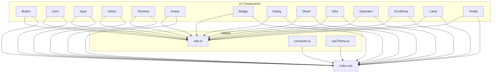

**Diagram sources**
- [button.tsx:1-59](file://src/components/ui/button.tsx#L1-L59)
- [card.tsx:1-104](file://src/components/ui/card.tsx#L1-L104)
- [input.tsx:1-21](file://src/components/ui/input.tsx#L1-L21)
- [select.tsx:1-200](file://src/components/ui/select.tsx#L1-L200)
- [textarea.tsx:1-19](file://src/components/ui/textarea.tsx#L1-L19)
- [avatar.tsx:1-110](file://src/components/ui/avatar.tsx#L1-L110)
- [badge.tsx:1-53](file://src/components/ui/badge.tsx#L1-L53)
- [dialog.tsx:1-161](file://src/components/ui/dialog.tsx#L1-L161)
- [sheet.tsx:1-137](file://src/components/ui/sheet.tsx#L1-L137)
- [tabs.tsx:1-81](file://src/components/ui/tabs.tsx#L1-L81)
- [separator.tsx:1-26](file://src/components/ui/separator.tsx#L1-L26)
- [scroll-area.tsx:1-53](file://src/components/ui/scroll-area.tsx#L1-L53)
- [label.tsx:1-21](file://src/components/ui/label.tsx#L1-L21)
- [tooltip.tsx:1-65](file://src/components/ui/tooltip.tsx#L1-L65)
- [utils.ts:1-7](file://src/lib/utils.ts#L1-L7)
- [index.css:1-402](file://src/index.css#L1-L402)
- [useTheme.ts:1-70](file://src/hooks/useTheme.ts#L1-L70)

**Section sources**
- [button.tsx:1-59](file://src/components/ui/button.tsx#L1-L59)
- [card.tsx:1-104](file://src/components/ui/card.tsx#L1-L104)
- [input.tsx:1-21](file://src/components/ui/input.tsx#L1-L21)
- [select.tsx:1-200](file://src/components/ui/select.tsx#L1-L200)
- [textarea.tsx:1-19](file://src/components/ui/textarea.tsx#L1-L19)
- [avatar.tsx:1-110](file://src/components/ui/avatar.tsx#L1-L110)
- [badge.tsx:1-53](file://src/components/ui/badge.tsx#L1-L53)
- [dialog.tsx:1-161](file://src/components/ui/dialog.tsx#L1-L161)
- [sheet.tsx:1-137](file://src/components/ui/sheet.tsx#L1-L137)
- [tabs.tsx:1-81](file://src/components/ui/tabs.tsx#L1-L81)
- [separator.tsx:1-26](file://src/components/ui/separator.tsx#L1-L26)
- [scroll-area.tsx:1-53](file://src/components/ui/scroll-area.tsx#L1-L53)
- [label.tsx:1-21](file://src/components/ui/label.tsx#L1-L21)
- [tooltip.tsx:1-65](file://src/components/ui/tooltip.tsx#L1-L65)
- [utils.ts:1-7](file://src/lib/utils.ts#L1-L7)
- [index.css:1-402](file://src/index.css#L1-L402)
- [useTheme.ts:1-70](file://src/hooks/useTheme.ts#L1-L70)

## Core Components
This section summarizes the 12 base UI components, their primary props, variants, and composition patterns. Each component is documented with:
- Purpose and typical usage
- Props and variant options
- Accessibility features
- Composition patterns with other components
- Relationship to design tokens and theming

- Button
  - Purpose: Trigger actions with multiple variants and sizes.
  - Props: className, variant, size, plus primitive props.
  - Variants: default, outline, secondary, ghost, destructive, link.
  - Sizes: default, xs, sm, lg, icon, icon-xs, icon-sm, icon-lg.
  - Accessibility: Focus-visible ring, disabled states, aria-invalid integration.
  - Composition: Often used inside CardFooter, DialogFooter, TabsTrigger, and form controls.
  - Tokens: Inherits from primary/secondary/muted/accent palette; ring color for focus.

- Card
  - Purpose: Group related content with optional header/title/description/action/content/footer.
  - Props: size ("default" | "sm"), plus HTML div props.
  - Composition: Header/title/description/action/content/footer slots; footer commonly holds Buttons.
  - Accessibility: No explicit ARIA roles; relies on semantic structure.
  - Tokens: Uses card/popover/background surfaces; ring and border tokens for elevation.

- Input
  - Purpose: Single-line text entry with consistent focus states and invalid feedback.
  - Props: className, type, plus primitive props.
  - Accessibility: Focus-visible ring, disabled states, aria-invalid integration.
  - Composition: Combined with Label, Select, and Button in forms.
  - Tokens: Input surface, foreground, muted foreground for placeholders.

- Select
  - Purpose: Dropdown selection with groups, labels, items, separators, and scroll buttons.
  - Props: Root, Trigger (size), Content (positioning), Value, Group, GroupLabel, Item, Separator, ScrollUp/DownButton.
  - Accessibility: Uses Base UI Select primitives; integrates with focus-visible and disabled states.
  - Composition: Often paired with Input/Label; nested in Card or Dialog.
  - Tokens: Popover background, accent/foreground for focus states.

- Textarea
  - Purpose: Multi-line text entry with consistent focus and invalid states.
  - Props: className, plus textarea props.
  - Accessibility: Focus-visible ring, disabled states, aria-invalid integration.
  - Composition: Used alongside Label and Button in forms.
  - Tokens: Same as Input for consistency.

- Avatar
  - Purpose: Display user identity with image fallback and badges.
  - Props: size ("default" | "sm" | "lg"), plus primitive props.
  - Composition: AvatarGroup and AvatarGroupCount for presence indicators; AvatarBadge for status.
  - Accessibility: No explicit ARIA roles; ensure alt text on images when used.
  - Tokens: Primary/foreground for badge; ring/background for borders.

- Badge
  - Purpose: Short labels for status or metadata.
  - Props: variant (default, secondary, destructive, outline, ghost, link), plus render/state props.
  - Variants: default, secondary, destructive, outline, ghost, link.
  - Accessibility: No special ARIA; acts as a decorative or labeling element.
  - Tokens: Primary/secondary/accent palette; destructive for warnings.

- Dialog
  - Purpose: Modal overlays with header/footer/title/description and optional close button.
  - Props: Root, Portal, Overlay, Popup (content), Header/Footer, Title, Description, Trigger, Close.
  - Accessibility: Uses Base UI Dialog; includes sr-only “Close” text; controlled focus.
  - Composition: Contains Cards, Forms, and Buttons; often wraps Sheets.
  - Tokens: Popover background; overlay uses backdrop blur and alpha.

- Sheet
  - Purpose: Slide-out panels from sides with overlay and optional close button.
  - Props: Root, Portal, Overlay, Popup (content, side), Header/Footer, Title, Description, Trigger, Close.
  - Accessibility: Uses Base UI Dialog; includes sr-only “Close” text; controlled focus.
  - Composition: Often used for filters, navigation, or secondary actions.
  - Tokens: Popover background; overlay uses backdrop blur and alpha.

- Tabs
  - Purpose: Organize content into selectable sections.
  - Props: Root (orientation), List (variant), Tab (trigger), Panel (content).
  - Variants: List variant "default" and "line".
  - Accessibility: Uses Base UI Tabs; active states and focus-visible rings.
  - Composition: TabsTrigger often contains Button or Badge; TabsContent hosts Cards/forms.
  - Tokens: Muted background for list; active tab uses background/foreground.

- Separator
  - Purpose: Visually separate sections.
  - Props: orientation ("horizontal" | "vertical").
  - Accessibility: Stateless; ensure semantic grouping elsewhere.
  - Tokens: Border color token.

- ScrollArea
  - Purpose: Customizable scrollable regions with draggable thumbs.
  - Props: Root, Viewport, Scrollbar (orientation), Corner.
  - Accessibility: Uses Base UI ScrollArea; focus-visible ring on viewport.
  - Composition: Used within Dialog/Sheet/Card to constrain content.
  - Tokens: Border color for thumb.

- Label
  - Purpose: Associate text with form controls.
  - Props: className, plus label props.
  - Accessibility: Peer/focus/disabled states; integrates with inputs.
  - Composition: Always paired with Input/Select/Textarea.
  - Tokens: Foreground/muted foreground for text.

- Tooltip
  - Purpose: Provide contextual help on hover/focus.
  - Props: Provider (delay), Root, Trigger, Popup (positioning), Arrow.
  - Accessibility: Uses Base UI Tooltip; controlled by pointer and keyboard.
  - Composition: Wrap interactive elements (Button, TabsTrigger, etc.).
  - Tokens: Foreground/background for content; arrow uses rotated square.

**Section sources**
- [button.tsx:1-59](file://src/components/ui/button.tsx#L1-L59)
- [card.tsx:1-104](file://src/components/ui/card.tsx#L1-L104)
- [input.tsx:1-21](file://src/components/ui/input.tsx#L1-L21)
- [select.tsx:1-200](file://src/components/ui/select.tsx#L1-L200)
- [textarea.tsx:1-19](file://src/components/ui/textarea.tsx#L1-L19)
- [avatar.tsx:1-110](file://src/components/ui/avatar.tsx#L1-L110)
- [badge.tsx:1-53](file://src/components/ui/badge.tsx#L1-L53)
- [dialog.tsx:1-161](file://src/components/ui/dialog.tsx#L1-L161)
- [sheet.tsx:1-137](file://src/components/ui/sheet.tsx#L1-L137)
- [tabs.tsx:1-81](file://src/components/ui/tabs.tsx#L1-L81)
- [separator.tsx:1-26](file://src/components/ui/separator.tsx#L1-L26)
- [scroll-area.tsx:1-53](file://src/components/ui/scroll-area.tsx#L1-L53)
- [label.tsx:1-21](file://src/components/ui/label.tsx#L1-L21)
- [tooltip.tsx:1-65](file://src/components/ui/tooltip.tsx#L1-L65)

## Architecture Overview
The component library follows a consistent pattern:
- Each component is a small wrapper around a Base UI primitive.
- Styles are applied via Tailwind utilities bound to design tokens.
- Variants are generated with class-variance-authority (cva) for predictable overrides.
- Utilities (cn) merge and deduplicate Tailwind classes.
- Theming is driven by CSS variables and a light React hook that toggles a root class and persists preferences.

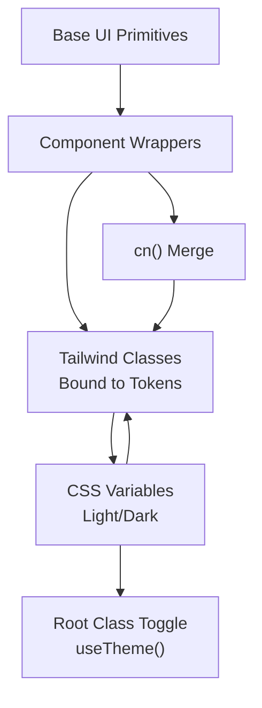

**Diagram sources**
- [button.tsx:1-59](file://src/components/ui/button.tsx#L1-L59)
- [card.tsx:1-104](file://src/components/ui/card.tsx#L1-L104)
- [input.tsx:1-21](file://src/components/ui/input.tsx#L1-L21)
- [select.tsx:1-200](file://src/components/ui/select.tsx#L1-L200)
- [textarea.tsx:1-19](file://src/components/ui/textarea.tsx#L1-L19)
- [avatar.tsx:1-110](file://src/components/ui/avatar.tsx#L1-L110)
- [badge.tsx:1-53](file://src/components/ui/badge.tsx#L1-L53)
- [dialog.tsx:1-161](file://src/components/ui/dialog.tsx#L1-L161)
- [sheet.tsx:1-137](file://src/components/ui/sheet.tsx#L1-L137)
- [tabs.tsx:1-81](file://src/components/ui/tabs.tsx#L1-L81)
- [separator.tsx:1-26](file://src/components/ui/separator.tsx#L1-L26)
- [scroll-area.tsx:1-53](file://src/components/ui/scroll-area.tsx#L1-L53)
- [label.tsx:1-21](file://src/components/ui/label.tsx#L1-L21)
- [tooltip.tsx:1-65](file://src/components/ui/tooltip.tsx#L1-L65)
- [utils.ts:1-7](file://src/lib/utils.ts#L1-L7)
- [index.css:1-402](file://src/index.css#L1-L402)
- [useTheme.ts:1-70](file://src/hooks/useTheme.ts#L1-L70)

## Detailed Component Analysis

### Button
- Props
  - className: Additional Tailwind classes.
  - variant: default | outline | secondary | ghost | destructive | link.
  - size: default | xs | sm | lg | icon | icon-xs | icon-sm | icon-lg.
  - All other props pass through to the primitive.
- Variants and sizes
  - Variant palette: primary, secondary, muted/accent, destructive, link.
  - Size scale: default, xs, sm, lg, and icon variants with consistent spacing and radius tokens.
- Accessibility
  - Focus-visible ring uses ring token; disabled states apply pointer-events-none and reduced opacity.
  - aria-invalid integrates destructive ring on invalid states.
- Composition
  - Used inside CardFooter, DialogFooter, TabsTrigger, and as a close trigger in Dialog/Sheet.
- Theming and tokens
  - Backgrounds and text colors derive from primary/secondary/accent/muted; ring color for focus.
- Customization
  - Override via className; variant and size are preferred for consistency.

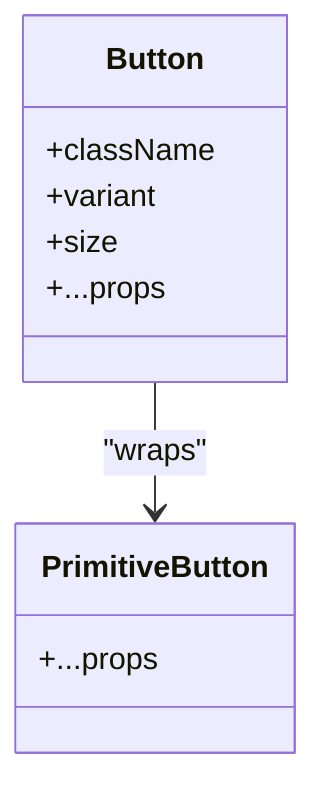

**Diagram sources**
- [button.tsx:1-59](file://src/components/ui/button.tsx#L1-L59)

**Section sources**
- [button.tsx:1-59](file://src/components/ui/button.tsx#L1-L59)

### Card
- Props
  - size: "default" | "sm".
  - Slot-based subcomponents: header, title, description, action, content, footer.
- Composition
  - Header grid supports title + action; content/footer provide structured spacing.
- Accessibility
  - No ARIA roles; rely on semantic structure and size attributes.
- Theming
  - Uses card/popover/background; ring and border tokens for elevation.

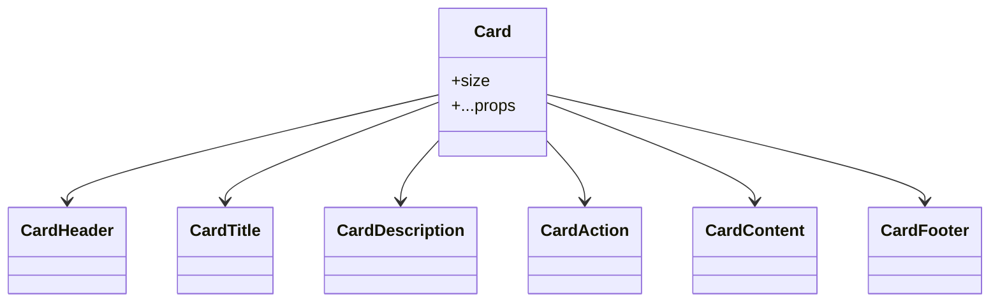

**Diagram sources**
- [card.tsx:1-104](file://src/components/ui/card.tsx#L1-L104)

**Section sources**
- [card.tsx:1-104](file://src/components/ui/card.tsx#L1-L104)

### Input
- Props
  - className, type, plus primitive props.
- Accessibility
  - Focus-visible ring, disabled states, aria-invalid integration.
- Composition
  - Pairs with Label; used within Card/Dialog/Sheet.

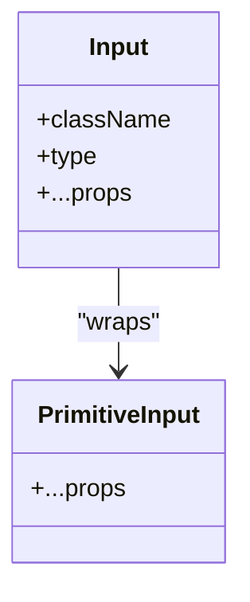

**Diagram sources**
- [input.tsx:1-21](file://src/components/ui/input.tsx#L1-L21)

**Section sources**
- [input.tsx:1-21](file://src/components/ui/input.tsx#L1-L21)

### Select
- Props and subcomponents
  - Root, Trigger (size), Value, Group, GroupLabel, Content (positioning), Item, Separator, ScrollUp/DownButton.
- Accessibility
  - Built on Base UI Select; integrates focus-visible and disabled states.
- Composition
  - Often combined with Input/Label; nested in Card/Dialog.

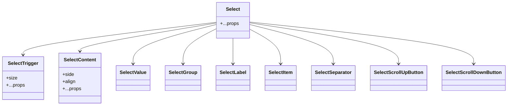

**Diagram sources**
- [select.tsx:1-200](file://src/components/ui/select.tsx#L1-L200)

**Section sources**
- [select.tsx:1-200](file://src/components/ui/select.tsx#L1-L200)

### Textarea
- Props
  - className, plus textarea props.
- Accessibility
  - Focus-visible ring, disabled states, aria-invalid integration.
- Composition
  - Pairs with Label and Button in forms.

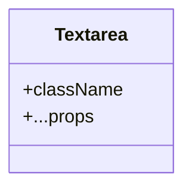

**Diagram sources**
- [textarea.tsx:1-19](file://src/components/ui/textarea.tsx#L1-L19)

**Section sources**
- [textarea.tsx:1-19](file://src/components/ui/textarea.tsx#L1-L19)

### Avatar
- Props
  - size: "default" | "sm" | "lg".
  - Subcomponents: Image, Fallback, Badge, Group, GroupCount.
- Composition
  - AvatarGroup applies negative spacing and ring borders; Badge scales with size.
- Accessibility
  - Ensure alt text on images; no ARIA role required.

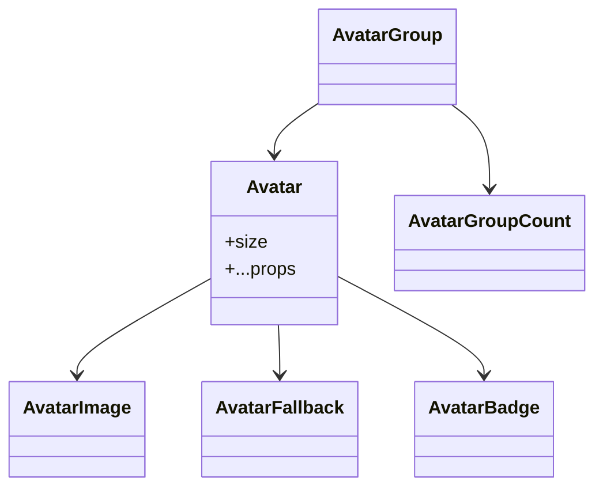

**Diagram sources**
- [avatar.tsx:1-110](file://src/components/ui/avatar.tsx#L1-L110)

**Section sources**
- [avatar.tsx:1-110](file://src/components/ui/avatar.tsx#L1-L110)

### Badge
- Props
  - variant: default | secondary | destructive | outline | ghost | link.
  - render/state props via Base UI renderer.
- Accessibility
  - No special ARIA; acts as a label or status indicator.
- Theming
  - Inherits from primary/secondary/accent palette; destructive for warnings.

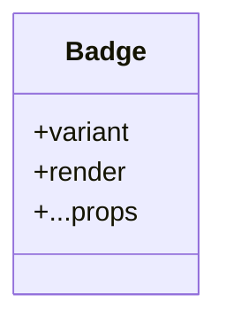

**Diagram sources**
- [badge.tsx:1-53](file://src/components/ui/badge.tsx#L1-L53)

**Section sources**
- [badge.tsx:1-53](file://src/components/ui/badge.tsx#L1-L53)

### Dialog
- Props and subcomponents
  - Root, Portal, Overlay, Popup (content), Header/Footer, Title, Description, Trigger, Close.
- Accessibility
  - Uses Base UI Dialog; includes sr-only “Close” text; controlled focus.
- Composition
  - Often contains Card, Form, and Button; can wrap Sheets.

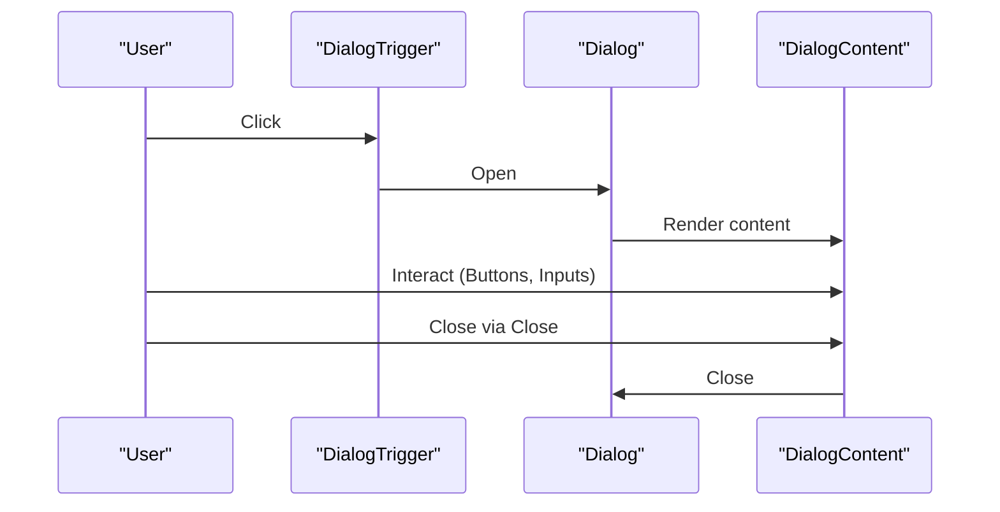

**Diagram sources**
- [dialog.tsx:1-161](file://src/components/ui/dialog.tsx#L1-L161)

**Section sources**
- [dialog.tsx:1-161](file://src/components/ui/dialog.tsx#L1-L161)

### Sheet
- Props and subcomponents
  - Root, Portal, Overlay, Popup (content, side), Header/Footer, Title, Description, Trigger, Close.
- Accessibility
  - Uses Base UI Dialog; includes sr-only “Close” text; controlled focus.
- Composition
  - Often used for filters/navigation; can host Tabs/ScrollArea.

**Diagram sources**
- [sheet.tsx:1-137](file://src/components/ui/sheet.tsx#L1-L137)

**Section sources**
- [sheet.tsx:1-137](file://src/components/ui/sheet.tsx#L1-L137)

### Tabs
- Props and subcomponents
  - Root (orientation), List (variant), Tab (trigger), Panel (content).
- Variants
  - List variant "default" and "line".
- Accessibility
  - Uses Base UI Tabs; active states and focus-visible rings.
- Composition
  - TabsTrigger often contains Button/Badge; TabsContent hosts Cards/forms.

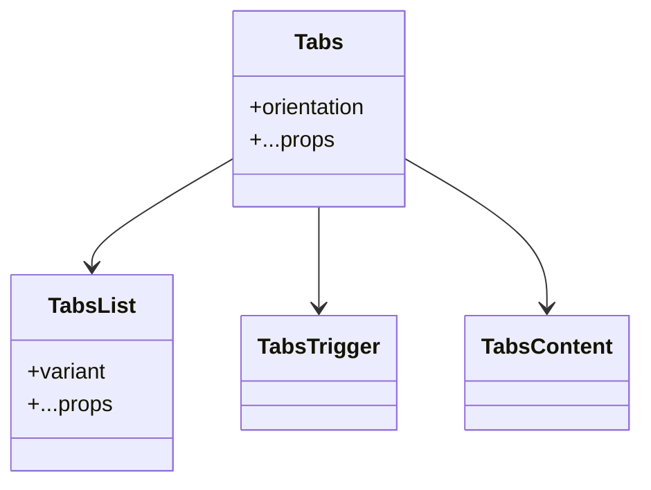

**Diagram sources**
- [tabs.tsx:1-81](file://src/components/ui/tabs.tsx#L1-L81)

**Section sources**
- [tabs.tsx:1-81](file://src/components/ui/tabs.tsx#L1-L81)

### Separator
- Props
  - orientation: "horizontal" | "vertical".
- Accessibility
  - Stateless; ensure semantic grouping elsewhere.

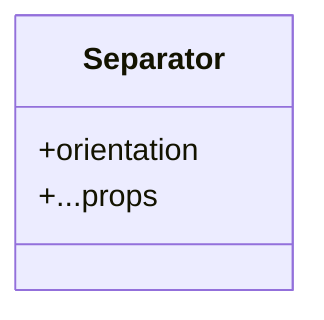

**Diagram sources**
- [separator.tsx:1-26](file://src/components/ui/separator.tsx#L1-L26)

**Section sources**
- [separator.tsx:1-26](file://src/components/ui/separator.tsx#L1-L26)

### ScrollArea
- Props and subcomponents
  - Root, Viewport, Scrollbar (orientation), Corner.
- Accessibility
  - Uses Base UI ScrollArea; focus-visible ring on viewport.
- Composition
  - Used within Dialog/Sheet/Card to constrain content.

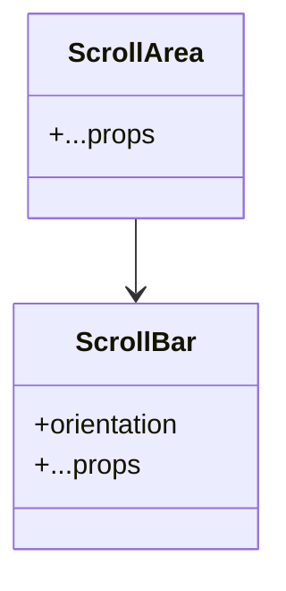

**Diagram sources**
- [scroll-area.tsx:1-53](file://src/components/ui/scroll-area.tsx#L1-L53)

**Section sources**
- [scroll-area.tsx:1-53](file://src/components/ui/scroll-area.tsx#L1-L53)

### Label
- Props
  - className, plus label props.
- Accessibility
  - Peer/focus/disabled states; integrates with inputs.

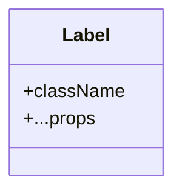

**Diagram sources**
- [label.tsx:1-21](file://src/components/ui/label.tsx#L1-L21)

**Section sources**
- [label.tsx:1-21](file://src/components/ui/label.tsx#L1-L21)

### Tooltip
- Props and subcomponents
  - Provider (delay), Root, Trigger, Popup (positioning), Arrow.
- Accessibility
  - Uses Base UI Tooltip; controlled by pointer and keyboard.
- Composition
  - Wrap interactive elements (Button, TabsTrigger, etc.).

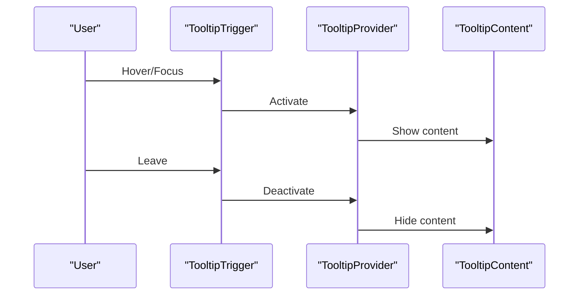

**Diagram sources**
- [tooltip.tsx:1-65](file://src/components/ui/tooltip.tsx#L1-L65)

**Section sources**
- [tooltip.tsx:1-65](file://src/components/ui/tooltip.tsx#L1-L65)

## Dependency Analysis
- Component coupling
  - All components depend on cn() for class merging and Tailwind utilities bound to design tokens.
  - Many components compose others (e.g., Dialog/Sheet content contains Button; Tabs triggers use Button/Badge).
- External dependencies
  - Base UI primitives for accessible semantics.
  - class-variance-authority for variant systems.
  - lucide-react icons for affordance visuals.
- Theming
  - CSS variables define light/dark palettes; useTheme toggles a root class and persists user preference.

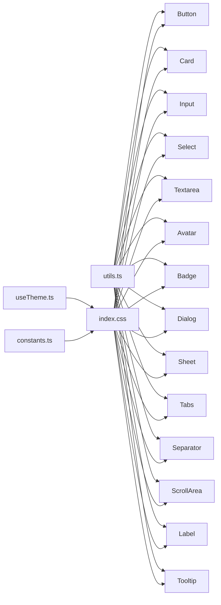

**Diagram sources**
- [utils.ts:1-7](file://src/lib/utils.ts#L1-L7)
- [index.css:1-402](file://src/index.css#L1-L402)
- [useTheme.ts:1-70](file://src/hooks/useTheme.ts#L1-L70)
- [constants.ts:1-85](file://src/lib/constants.ts#L1-L85)
- [button.tsx:1-59](file://src/components/ui/button.tsx#L1-L59)
- [card.tsx:1-104](file://src/components/ui/card.tsx#L1-L104)
- [input.tsx:1-21](file://src/components/ui/input.tsx#L1-L21)
- [select.tsx:1-200](file://src/components/ui/select.tsx#L1-L200)
- [textarea.tsx:1-19](file://src/components/ui/textarea.tsx#L1-L19)
- [avatar.tsx:1-110](file://src/components/ui/avatar.tsx#L1-L110)
- [badge.tsx:1-53](file://src/components/ui/badge.tsx#L1-L53)
- [dialog.tsx:1-161](file://src/components/ui/dialog.tsx#L1-L161)
- [sheet.tsx:1-137](file://src/components/ui/sheet.tsx#L1-L137)
- [tabs.tsx:1-81](file://src/components/ui/tabs.tsx#L1-L81)
- [separator.tsx:1-26](file://src/components/ui/separator.tsx#L1-L26)
- [scroll-area.tsx:1-53](file://src/components/ui/scroll-area.tsx#L1-L53)
- [label.tsx:1-21](file://src/components/ui/label.tsx#L1-L21)
- [tooltip.tsx:1-65](file://src/components/ui/tooltip.tsx#L1-L65)

**Section sources**
- [utils.ts:1-7](file://src/lib/utils.ts#L1-L7)
- [index.css:1-402](file://src/index.css#L1-L402)
- [useTheme.ts:1-70](file://src/hooks/useTheme.ts#L1-L70)
- [constants.ts:1-85](file://src/lib/constants.ts#L1-L85)
- [button.tsx:1-59](file://src/components/ui/button.tsx#L1-L59)
- [card.tsx:1-104](file://src/components/ui/card.tsx#L1-L104)
- [input.tsx:1-21](file://src/components/ui/input.tsx#L1-L21)
- [select.tsx:1-200](file://src/components/ui/select.tsx#L1-L200)
- [textarea.tsx:1-19](file://src/components/ui/textarea.tsx#L1-L19)
- [avatar.tsx:1-110](file://src/components/ui/avatar.tsx#L1-L110)
- [badge.tsx:1-53](file://src/components/ui/badge.tsx#L1-L53)
- [dialog.tsx:1-161](file://src/components/ui/dialog.tsx#L1-L161)
- [sheet.tsx:1-137](file://src/components/ui/sheet.tsx#L1-L137)
- [tabs.tsx:1-81](file://src/components/ui/tabs.tsx#L1-L81)
- [separator.tsx:1-26](file://src/components/ui/separator.tsx#L1-L26)
- [scroll-area.tsx:1-53](file://src/components/ui/scroll-area.tsx#L1-L53)
- [label.tsx:1-21](file://src/components/ui/label.tsx#L1-L21)
- [tooltip.tsx:1-65](file://src/components/ui/tooltip.tsx#L1-L65)

## Performance Considerations
- Prefer variant and size props over ad-hoc className overrides to keep rendering predictable and cache-friendly.
- Use cn() to merge classes efficiently; avoid excessive re-computation by passing memoized className values.
- Limit deep nesting in Dialog/Sheet content; prefer shallow compositions to reduce reflows.
- Use ScrollArea judiciously; large lists benefit from virtualization outside this component.
- Keep Tooltip content minimal; avoid heavy DOM subtrees inside TooltipContent.
- Leverage CSS transitions and animations sparingly; the design system includes subtle motion tokens.

## Troubleshooting Guide
- Focus ring not visible
  - Ensure ring token is applied; check focus-visible utilities and that the component supports focus-visible.
- Disabled state not working
  - Verify disabled props are passed to the primitive and that disabled classes are present.
- Invalid state styling not appearing
  - Confirm aria-invalid is set; destructive variants and ring classes require this attribute.
- Theming not switching
  - Confirm useTheme is invoked and the root class toggles; check localStorage availability and system preference handling.
- Tooltip not positioning correctly
  - Adjust side/align offsets; ensure TooltipProvider wraps interactive elements and that portal rendering is intact.
- Scrollbar not visible
  - Ensure ScrollBar is rendered within ScrollArea and that orientation matches intended direction.

**Section sources**
- [button.tsx:1-59](file://src/components/ui/button.tsx#L1-L59)
- [input.tsx:1-21](file://src/components/ui/input.tsx#L1-L21)
- [select.tsx:1-200](file://src/components/ui/select.tsx#L1-L200)
- [dialog.tsx:1-161](file://src/components/ui/dialog.tsx#L1-L161)
- [sheet.tsx:1-137](file://src/components/ui/sheet.tsx#L1-L137)
- [tabs.tsx:1-81](file://src/components/ui/tabs.tsx#L1-L81)
- [tooltip.tsx:1-65](file://src/components/ui/tooltip.tsx#L1-L65)
- [scroll-area.tsx:1-53](file://src/components/ui/scroll-area.tsx#L1-L53)
- [useTheme.ts:1-70](file://src/hooks/useTheme.ts#L1-L70)

## Conclusion
RedRep’s component library emphasizes accessibility, composability, and design-token-driven theming. By leveraging Base UI primitives, cva variants, and a consistent class-merging utility, components remain predictable, customizable, and performant. The provided patterns enable teams to build cohesive interfaces quickly while maintaining adherence to the design system.

## Appendices

### Design Tokens and Theming
- Color tokens
  - Light mode: warm amber primary, ivory surfaces, indigo-emerald accents.
  - Dark mode: warm amber primary, deep midnight surfaces, glowing accents.
- Typography tokens
  - Display/body fonts configured via CSS variables; used across components.
- Motion and spacing
  - Motion durations and spacing rhythm defined centrally; used for animations and layout.
- Z-index scale
  - Dropdown, sticky, fixed, modal, popover, tooltip scales defined for stacking.

**Section sources**
- [index.css:1-402](file://src/index.css#L1-L402)
- [constants.ts:1-85](file://src/lib/constants.ts#L1-L85)
- [useTheme.ts:1-70](file://src/hooks/useTheme.ts#L1-L70)