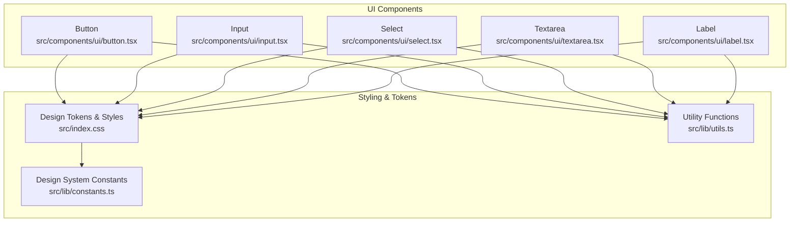
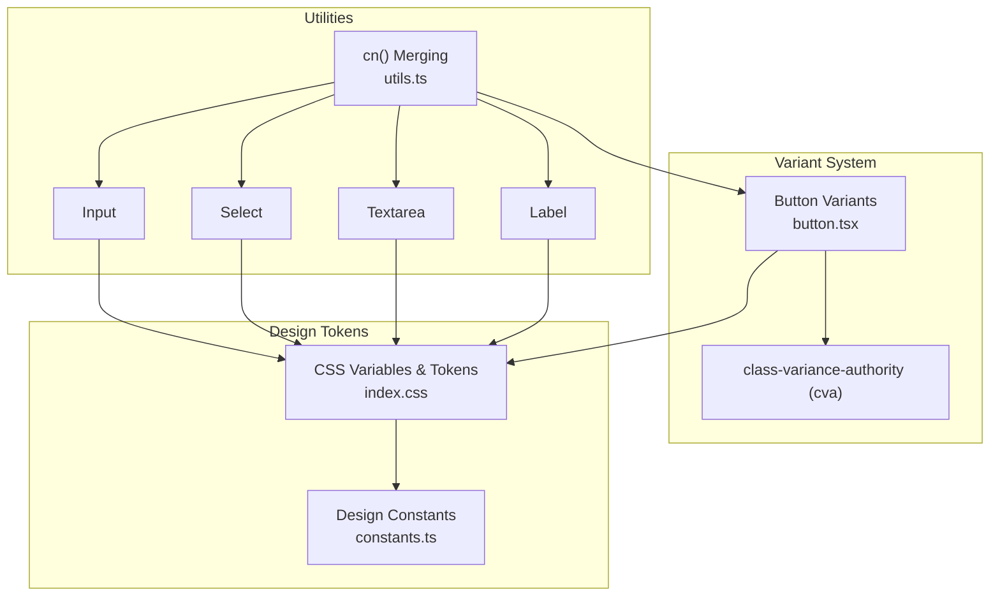
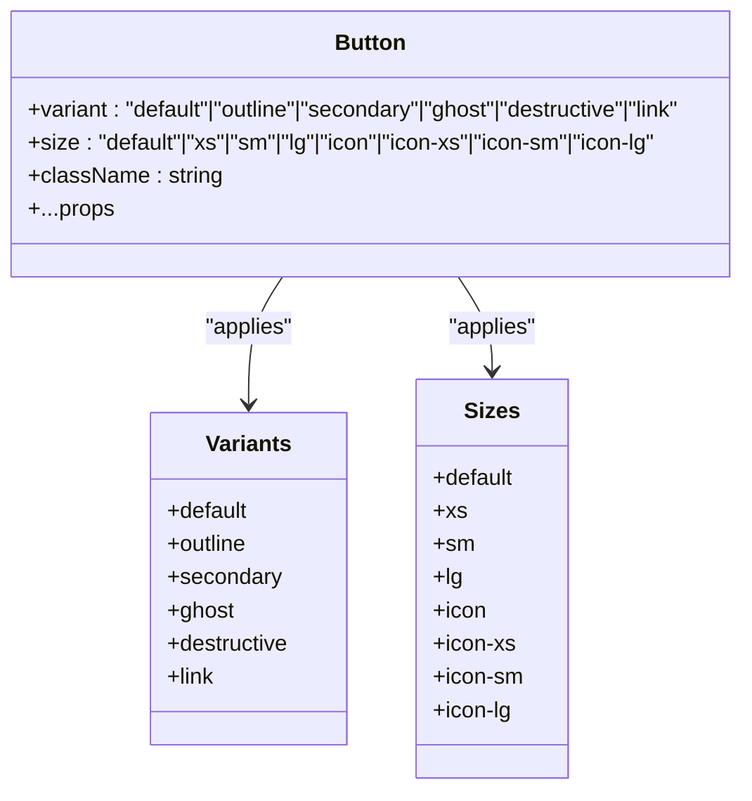
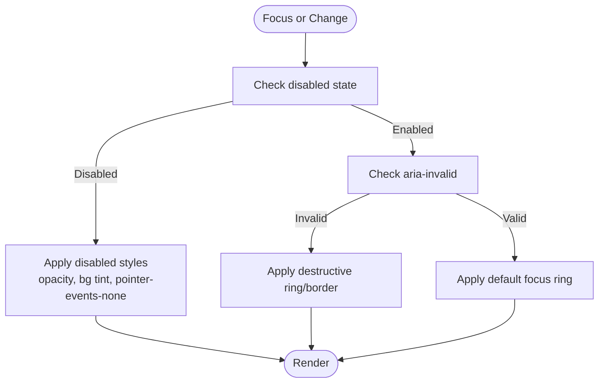
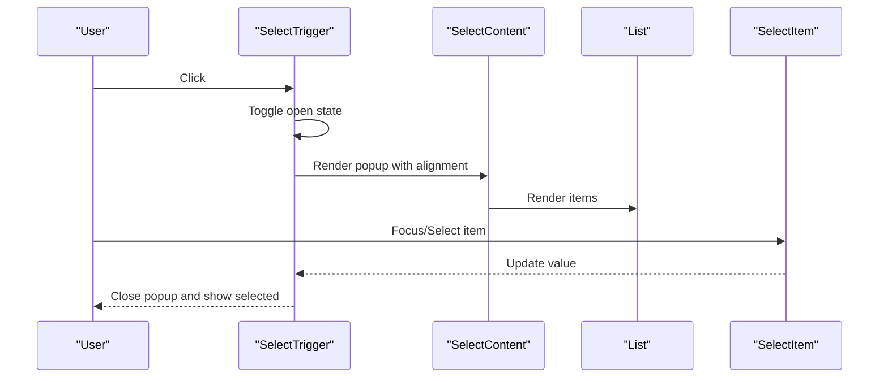
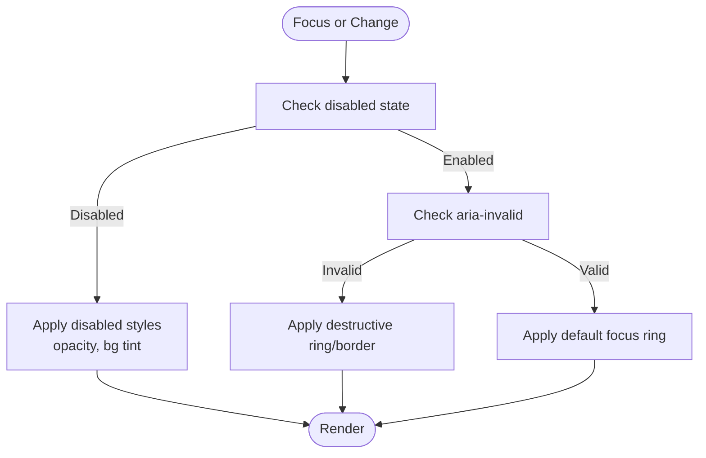
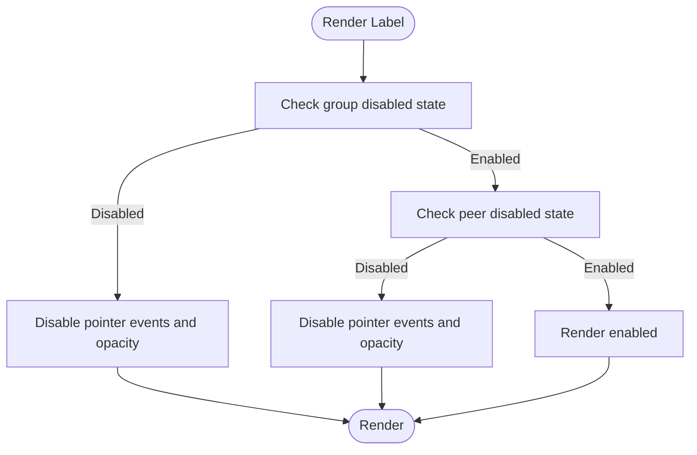
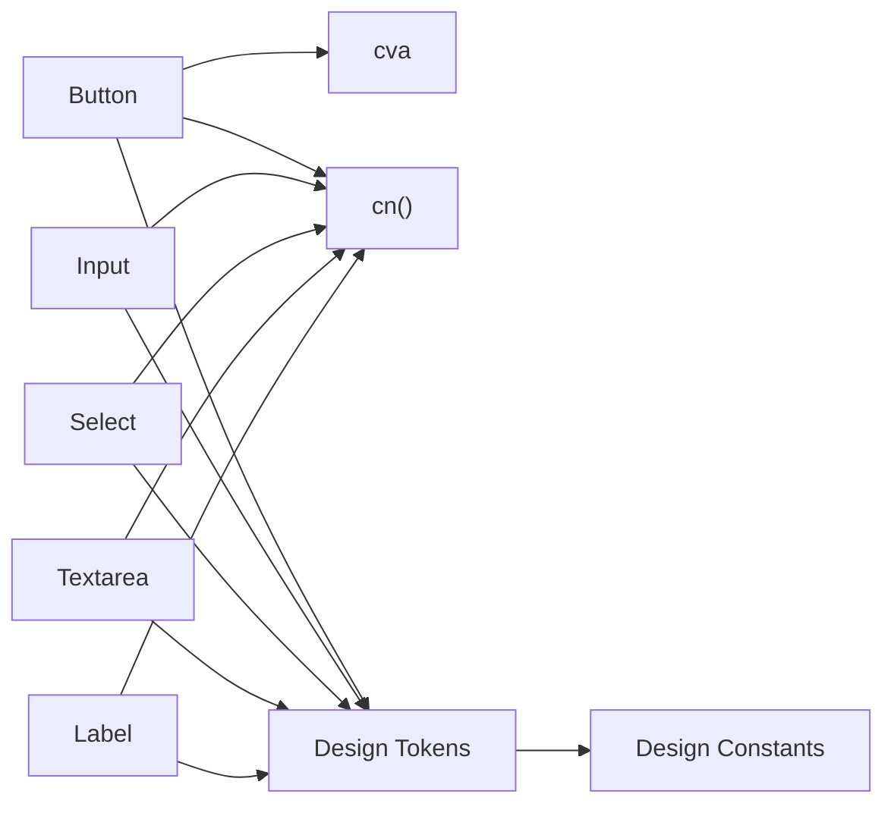

# Interactive Components

<cite>
**Referenced Files in This Document**
- [button.tsx](file://src/components/ui/button.tsx)
- [input.tsx](file://src/components/ui/input.tsx)
- [select.tsx](file://src/components/ui/select.tsx)
- [textarea.tsx](file://src/components/ui/textarea.tsx)
- [label.tsx](file://src/components/ui/label.tsx)
- [utils.ts](file://src/lib/utils.ts)
- [index.css](file://src/index.css)
- [constants.ts](file://src/lib/constants.ts)
</cite>

## Table of Contents
1. [Introduction](#introduction)
2. [Project Structure](#project-structure)
3. [Core Components](#core-components)
4. [Architecture Overview](#architecture-overview)
5. [Detailed Component Analysis](#detailed-component-analysis)
6. [Dependency Analysis](#dependency-analysis)
7. [Performance Considerations](#performance-considerations)
8. [Troubleshooting Guide](#troubleshooting-guide)
9. [Conclusion](#conclusion)
10. [Appendices](#appendices)

## Introduction
This document describes the interactive UI components in RedRep’s component library with a focus on Button, Input, Select, Textarea, and Label. It explains variant options, size variations, states, accessibility features, and integration patterns for building forms and interactive interfaces. It also documents the variant system built on design tokens and CSS classes, and provides practical examples for common scenarios such as form submission, dropdown selection, and input validation.

## Project Structure
The interactive components live under src/components/ui and are styled with Tailwind-based design tokens defined in src/index.css. Utility helpers in src/lib/utils merge and conditionally apply classes. The design system constants and typography are centralized in src/lib/constants.ts.

**Diagram sources**
- [button.tsx:1-59](file://src/components/ui/button.tsx#L1-L59)
- [input.tsx:1-21](file://src/components/ui/input.tsx#L1-L21)
- [select.tsx:1-200](file://src/components/ui/select.tsx#L1-L200)
- [textarea.tsx:1-19](file://src/components/ui/textarea.tsx#L1-L19)
- [label.tsx:1-21](file://src/components/ui/label.tsx#L1-L21)
- [index.css:1-402](file://src/index.css#L1-L402)
- [utils.ts:1-7](file://src/lib/utils.ts#L1-L7)
- [constants.ts:1-85](file://src/lib/constants.ts#L1-L85)

**Section sources**
- [button.tsx:1-59](file://src/components/ui/button.tsx#L1-L59)
- [input.tsx:1-21](file://src/components/ui/input.tsx#L1-L21)
- [select.tsx:1-200](file://src/components/ui/select.tsx#L1-L200)
- [textarea.tsx:1-19](file://src/components/ui/textarea.tsx#L1-L19)
- [label.tsx:1-21](file://src/components/ui/label.tsx#L1-L21)
- [index.css:1-402](file://src/index.css#L1-L402)
- [utils.ts:1-7](file://src/lib/utils.ts#L1-L7)
- [constants.ts:1-85](file://src/lib/constants.ts#L1-L85)

## Core Components
This section summarizes the interactive components, their variants, sizes, states, and accessibility features.

- Button
  - Variants: default, outline, secondary, ghost, destructive, link
  - Sizes: default, xs, sm, lg, icon, icon-xs, icon-sm, icon-lg
  - States: focus-visible ring, disabled, aria-invalid validation, expanded state
  - Accessibility: focus-visible ring, aria-invalid for validation feedback, pointer-event control for icons
  - Integration: supports inline icons via data attributes and groups

- Input
  - States: focus-visible ring, disabled, aria-invalid validation
  - Accessibility: focus-visible ring, placeholder text, disabled pointer events
  - Integration: file upload styles included for native file inputs

- Select
  - Triggers: default and small sizes with focus-visible ring and aria-invalid
  - Content: animated popup with scroll buttons and alignment options
  - Items: focusable items with indicator, disabled state, destructive variant support
  - Accessibility: controlled open/close, scroll arrows, alignment with trigger

- Textarea
  - States: focus-visible ring, disabled, aria-invalid validation
  - Accessibility: focus-visible ring, placeholder text, disabled pointer events

- Label
  - States: disabled via group and peer selectors, pointer-events disabled
  - Accessibility: associated with form controls via peer selectors, disabled pointer events

**Section sources**
- [button.tsx:6-41](file://src/components/ui/button.tsx#L6-L41)
- [input.tsx:6-18](file://src/components/ui/input.tsx#L6-L18)
- [select.tsx:29-55](file://src/components/ui/select.tsx#L29-L55)
- [select.tsx:57-94](file://src/components/ui/select.tsx#L57-L94)
- [select.tsx:109-135](file://src/components/ui/select.tsx#L109-L135)
- [textarea.tsx:5-16](file://src/components/ui/textarea.tsx#L5-L16)
- [label.tsx:7-17](file://src/components/ui/label.tsx#L7-L17)

## Architecture Overview
The components rely on a variant system powered by class-variance-authority (cva) for Button and Tailwind-based design tokens for all components. Focus-visible rings and validation states are unified through CSS variables and aria-* attributes. Utilities merge classes safely, and the design system defines brand, semantic, and surface tokens.

**Diagram sources**
- [button.tsx:1-59](file://src/components/ui/button.tsx#L1-L59)
- [index.css:1-402](file://src/index.css#L1-L402)
- [constants.ts:1-85](file://src/lib/constants.ts#L1-L85)
- [utils.ts:1-7](file://src/lib/utils.ts#L1-L7)

**Section sources**
- [button.tsx:1-59](file://src/components/ui/button.tsx#L1-L59)
- [index.css:1-402](file://src/index.css#L1-L402)
- [utils.ts:1-7](file://src/lib/utils.ts#L1-L7)
- [constants.ts:1-85](file://src/lib/constants.ts#L1-L85)

## Detailed Component Analysis

### Button
- Variant system
  - Uses cva to compose base classes with variant and size mappings.
  - Variant classes control background, text color, borders, and hover effects.
  - Size classes control height, padding, gap, and icon sizing.
- Focus and validation
  - Focus-visible ring uses ring color tokens; validation uses aria-invalid with destructively themed ring.
- Disabled and expanded states
  - Disabled state applies opacity and pointer-events-none.
  - Expanded state classes are applied for accessible expanded indicators.
- Icon and grouping
  - Supports inline icons via data attributes and adjusts padding accordingly.
  - Group-aware rounding for adjacent buttons.

**Diagram sources**
- [button.tsx:6-41](file://src/components/ui/button.tsx#L6-L41)

**Section sources**
- [button.tsx:6-41](file://src/components/ui/button.tsx#L6-L41)

### Input
- Focus-visible ring and validation
  - Focus ring uses ring color tokens; aria-invalid toggles destructive ring and border.
- Disabled state
  - Disables pointer events, sets opacity and background tint.
- File input styles
  - Includes styles for native file inputs to match the design system.

**Diagram sources**
- [input.tsx:6-18](file://src/components/ui/input.tsx#L6-L18)

**Section sources**
- [input.tsx:6-18](file://src/components/ui/input.tsx#L6-L18)

### Select
- Trigger
  - Supports size variants (default/sm) with height and radius adjustments.
  - Focus-visible ring and aria-invalid validation.
- Popup and positioning
  - Animated popup with alignment and offset options; scroll buttons included.
- Item rendering
  - Focusable items with indicator, destructive variant support, and disabled state.
- Accessibility
  - Controlled open/close, scroll arrows, and alignment with trigger.

**Diagram sources**
- [select.tsx:29-55](file://src/components/ui/select.tsx#L29-L55)
- [select.tsx:57-94](file://src/components/ui/select.tsx#L57-L94)
- [select.tsx:109-135](file://src/components/ui/select.tsx#L109-L135)

**Section sources**
- [select.tsx:29-55](file://src/components/ui/select.tsx#L29-L55)
- [select.tsx:57-94](file://src/components/ui/select.tsx#L57-L94)
- [select.tsx:109-135](file://src/components/ui/select.tsx#L109-L135)

### Textarea
- Focus-visible ring and validation
  - Focus ring uses ring color tokens; aria-invalid toggles destructive ring and border.
- Disabled state
  - Disables pointer events, sets opacity and background tint.

**Diagram sources**
- [textarea.tsx:5-16](file://src/components/ui/textarea.tsx#L5-L16)

**Section sources**
- [textarea.tsx:5-16](file://src/components/ui/textarea.tsx#L5-L16)

### Label
- Disabled state
  - Controlled via group-data and peer-disabled selectors to disable pointer events and set opacity.
- Accessibility
  - Designed to associate with form controls and remain selectable for usability.

**Diagram sources**
- [label.tsx:7-17](file://src/components/ui/label.tsx#L7-L17)

**Section sources**
- [label.tsx:7-17](file://src/components/ui/label.tsx#L7-L17)

## Dependency Analysis
- Component dependencies
  - Button depends on cva and cn for variant composition and class merging.
  - Input, Select, Textarea, and Label depend on cn for safe class merging and Tailwind tokens for styling.
- Token and theme dependencies
  - All components consume CSS variables for colors, radii, and ring colors.
  - Design constants define fonts, spacing, motion, and z-index scales.
- Accessibility and focus
  - Focus-visible ring is globally defined via CSS variables and applied consistently across components.
  - aria-invalid is used to signal validation states.

**Diagram sources**
- [button.tsx:1-59](file://src/components/ui/button.tsx#L1-L59)
- [input.tsx:1-21](file://src/components/ui/input.tsx#L1-L21)
- [select.tsx:1-200](file://src/components/ui/select.tsx#L1-L200)
- [textarea.tsx:1-19](file://src/components/ui/textarea.tsx#L1-L19)
- [label.tsx:1-21](file://src/components/ui/label.tsx#L1-L21)
- [utils.ts:1-7](file://src/lib/utils.ts#L1-L7)
- [index.css:1-402](file://src/index.css#L1-L402)
- [constants.ts:1-85](file://src/lib/constants.ts#L1-L85)

**Section sources**
- [button.tsx:1-59](file://src/components/ui/button.tsx#L1-L59)
- [input.tsx:1-21](file://src/components/ui/input.tsx#L1-L21)
- [select.tsx:1-200](file://src/components/ui/select.tsx#L1-L200)
- [textarea.tsx:1-19](file://src/components/ui/textarea.tsx#L1-L19)
- [label.tsx:1-21](file://src/components/ui/label.tsx#L1-L21)
- [utils.ts:1-7](file://src/lib/utils.ts#L1-L7)
- [index.css:1-402](file://src/index.css#L1-L402)
- [constants.ts:1-85](file://src/lib/constants.ts#L1-L85)

## Performance Considerations
- Variant composition
  - cva reduces runtime branching and improves maintainability of variant classes.
- Class merging
  - Using cn ensures minimal class duplication and avoids conflicts.
- Focus and animations
  - Focus-visible ring is defined globally; avoid excessive reflows by limiting dynamic class toggles.
- Reduced motion
  - The design system respects reduced motion preferences via media queries.

[No sources needed since this section provides general guidance]

## Troubleshooting Guide
- Button focus ring not visible
  - Ensure ring color tokens are defined and focus-visible styles are not overridden.
- Validation states not applying
  - Confirm aria-invalid is present and destructively themed ring classes are included.
- Select popup misaligned
  - Verify alignment and offset props; ensure portal renders within viewport constraints.
- Input/Textarea disabled state not working
  - Check disabled prop and ensure pointer-events-none and opacity/tint classes are applied.
- Label not disabling associated control
  - Confirm group disabled state or peer-disabled selectors are used appropriately.

**Section sources**
- [button.tsx:6-41](file://src/components/ui/button.tsx#L6-L41)
- [input.tsx:6-18](file://src/components/ui/input.tsx#L6-L18)
- [select.tsx:57-94](file://src/components/ui/select.tsx#L57-L94)
- [textarea.tsx:5-16](file://src/components/ui/textarea.tsx#L5-L16)
- [label.tsx:7-17](file://src/components/ui/label.tsx#L7-L17)
- [index.css:253-257](file://src/index.css#L253-L257)

## Conclusion
RedRep’s interactive components are built on a robust variant system and a consistent design token foundation. They provide clear visual states, strong accessibility support, and flexible integration patterns for forms and interactive interfaces. By leveraging cva, Tailwind tokens, and aria attributes, developers can compose accessible and maintainable UIs efficiently.

[No sources needed since this section summarizes without analyzing specific files]

## Appendices

### Practical Examples and Patterns
- Form submission with Button
  - Use destructive variant for “Cancel” actions, default for primary submit, outline for secondary actions.
  - Apply aria-invalid to related inputs to reflect validation errors.
- Dropdown selection with Select
  - Use small size for compact layouts; include scroll arrows for long lists.
  - Provide clear value updates and close-on-select behavior.
- Input validation
  - Set aria-invalid on inputs and labels to indicate invalid state; pair with helper text or tooltips.
- Keyboard navigation
  - Ensure focus order is logical; use Tab to move between fields and Enter/Space for actions.
- Accessibility checklist
  - All interactive elements have focus-visible rings.
  - aria-invalid communicates validation failures.
  - Disabled states prevent interaction and adjust opacity.
  - Icons inside interactive elements are not focusable.

[No sources needed since this section provides general guidance]