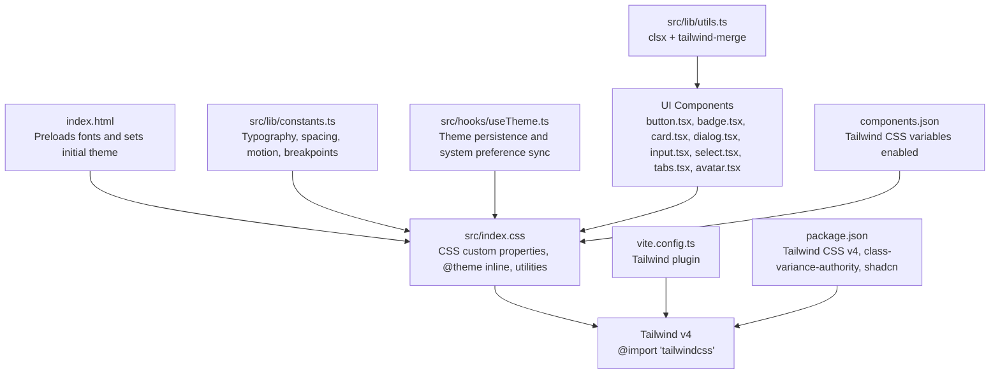
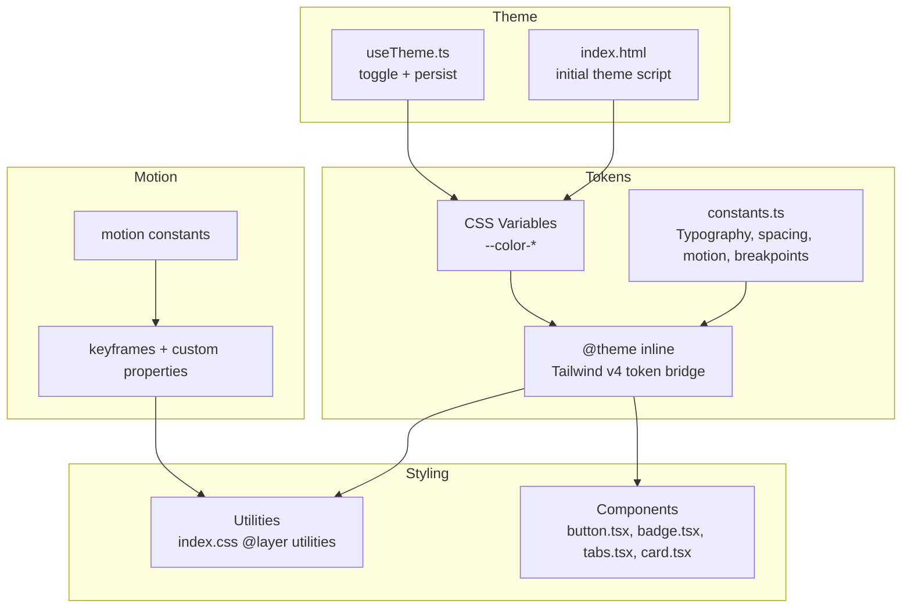
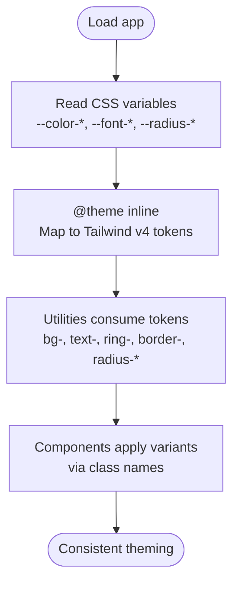
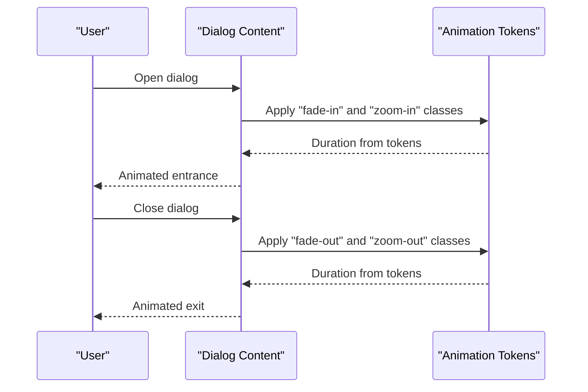
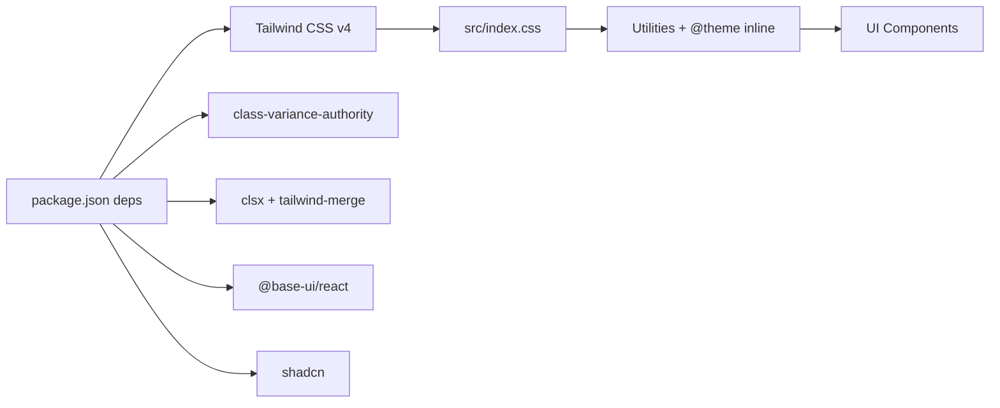

# Design System Architecture

<cite>
**Referenced Files in This Document**
- [README.md](file://README.md)
- [package.json](file://package.json)
- [index.html](file://index.html)
- [vite.config.ts](file://vite.config.ts)
- [src/index.css](file://src/index.css)
- [src/lib/constants.ts](file://src/lib/constants.ts)
- [src/lib/utils.ts](file://src/lib/utils.ts)
- [src/hooks/useTheme.ts](file://src/hooks/useTheme.ts)
- [src/components/ui/button.tsx](file://src/components/ui/button.tsx)
- [src/components/ui/badge.tsx](file://src/components/ui/badge.tsx)
- [src/components/ui/card.tsx](file://src/components/ui/card.tsx)
- [src/components/ui/dialog.tsx](file://src/components/ui/dialog.tsx)
- [src/components/ui/input.tsx](file://src/components/ui/input.tsx)
- [src/components/ui/select.tsx](file://src/components/ui/select.tsx)
- [src/components/ui/tabs.tsx](file://src/components/ui/tabs.tsx)
- [src/components/ui/avatar.tsx](file://src/components/ui/avatar.tsx)
- [components.json](file://components.json)
</cite>

## Table of Contents
1. [Introduction](#introduction)
2. [Project Structure](#project-structure)
3. [Core Components](#core-components)
4. [Architecture Overview](#architecture-overview)
5. [Detailed Component Analysis](#detailed-component-analysis)
6. [Dependency Analysis](#dependency-analysis)
7. [Performance Considerations](#performance-considerations)
8. [Troubleshooting Guide](#troubleshooting-guide)
9. [Conclusion](#conclusion)
10. [Appendices](#appendices)

## Introduction
This document describes the design system architecture for RedRep, a “Scholarly Neon” themed React application. It focuses on foundational design principles, the token-driven CSS custom property system, the Scholarly Neon aesthetic (neon color schemes, dark mode, and glass morphism), responsive design and breakpoints, the component variant system using class-variance-authority, motion design with five defined durations and entrance/exit animations, and integration with Tailwind CSS v4. It also provides extension guidelines and accessibility considerations.

## Project Structure
The design system is implemented primarily through:
- A centralized CSS layer that defines design tokens and Tailwind v4 token bridges
- A constants module for typography, spacing, motion, breakpoints, and category tokens
- A theme hook that toggles light/dark modes and persists preferences
- UI components leveraging class-variance-authority for consistent variants
- Utilities for merging class names and Tailwind v4 integration



**Diagram sources**
- [index.html:17-27](file://index.html#L17-L27)
- [src/index.css:1-402](file://src/index.css#L1-L402)
- [src/lib/constants.ts:1-85](file://src/lib/constants.ts#L1-L85)
- [src/hooks/useTheme.ts:1-70](file://src/hooks/useTheme.ts#L1-L70)
- [src/lib/utils.ts:1-7](file://src/lib/utils.ts#L1-L7)
- [vite.config.ts:1-15](file://vite.config.ts#L1-L15)
- [package.json:12-26](file://package.json#L12-L26)
- [components.json:6-12](file://components.json#L6-L12)

**Section sources**
- [README.md:1-74](file://README.md#L1-L74)
- [index.html:1-34](file://index.html#L1-L34)
- [src/index.css:1-402](file://src/index.css#L1-L402)
- [src/lib/constants.ts:1-85](file://src/lib/constants.ts#L1-L85)
- [src/hooks/useTheme.ts:1-70](file://src/hooks/useTheme.ts#L1-L70)
- [src/lib/utils.ts:1-7](file://src/lib/utils.ts#L1-L7)
- [vite.config.ts:1-15](file://vite.config.ts#L1-L15)
- [package.json:12-26](file://package.json#L12-L26)
- [components.json:6-12](file://components.json#L6-L12)

## Core Components
- Design tokens: Color palettes (light and dark), typography families, spacing rhythm, motion durations, z-index scale, and breakpoints
- CSS custom property architecture: Tailwind v4 token bridge mapping CSS variables to design tokens
- Motion system: Five durations and entrance/exit animations for consistent micro-interactions
- Component variant system: class-variance-authority for consistent styling across similar components
- Accessibility: Focus styles, reduced motion support, selection colors, and semantic markup

**Section sources**
- [src/lib/constants.ts:6-51](file://src/lib/constants.ts#L6-L51)
- [src/index.css:10-89](file://src/index.css#L10-L89)
- [src/index.css:285-401](file://src/index.css#L285-L401)
- [src/components/ui/button.tsx:6-41](file://src/components/ui/button.tsx#L6-L41)
- [src/components/ui/badge.tsx:7-28](file://src/components/ui/badge.tsx#L7-L28)
- [src/components/ui/tabs.tsx:24-37](file://src/components/ui/tabs.tsx#L24-L37)

## Architecture Overview
The design system centers on a single source of truth for tokens in CSS custom properties, bridged into Tailwind v4 via @theme inline. Components consume these tokens through Tailwind utilities and class-variance-authority variants. Theming is controlled by a React hook that toggles a class on the root element and persists user preference.



**Diagram sources**
- [src/index.css:10-89](file://src/index.css#L10-L89)
- [src/lib/constants.ts:6-31](file://src/lib/constants.ts#L6-L31)
- [src/index.css:54-89](file://src/index.css#L54-L89)
- [src/hooks/useTheme.ts:19-68](file://src/hooks/useTheme.ts#L19-L68)
- [index.html:17-27](file://index.html#L17-L27)

## Detailed Component Analysis

### Design Token System
- Color palettes: Brand primary, surfaces (background, foreground, card, popover), accents (primary/accent/secondary), semantic (muted, destructive), borders, inputs, rings, sidebar tokens, and chart tokens. Two themes—Warm Ivory (light) and Deep Midnight (dark)—each define oklch values for all tokens.
- Typography: Three families—display, body, and mono—mapped to CSS variables and used in base layer.
- Spacing: A base-4px rhythm with named tokens for section gaps, component gaps, and inner paddings.
- Motion: Five durations (fast, normal, slow, entrance, gradient mesh, float) and four animation primitives (gradient mesh, float, fade-in, slide-up, pulse-glow).
- Z-index: A small, explicit scale for predictable stacking.
- Breakpoints: Named breakpoints for responsive composition.

**Section sources**
- [src/index.css:94-192](file://src/index.css#L94-L192)
- [src/lib/constants.ts:6-51](file://src/lib/constants.ts#L6-L51)

### CSS Custom Property Architecture and Tailwind v4 Integration
- The @theme inline block maps CSS variables to Tailwind v4 tokens, enabling utilities like bg-*, text-*, ring-*, border-*, and radius utilities to automatically adapt to theme changes.
- Utilities in @layer utilities leverage CSS variables for gradients, glass morphism, elevation, noise overlay, section spacing, stagger delays, and scrollbar hiding.
- The design system uses oklch color spaces for perceptually uniform color transitions across themes.



**Diagram sources**
- [src/index.css:10-89](file://src/index.css#L10-L89)
- [src/index.css:285-401](file://src/index.css#L285-L401)

**Section sources**
- [src/index.css:10-89](file://src/index.css#L10-L89)
- [src/index.css:285-401](file://src/index.css#L285-L401)

### Scholarly Neon Aesthetic
- Color scheme: Warm Amber primary in light mode, glowing indigo-emerald accent palette; deep midnight surfaces with amber highlights in dark mode.
- Glass morphism: Backdrop blur/saturate with semi-transparent borders; separate rules for light and dark.
- Gradient mesh background and gradient text utilities for immersive visuals.
- Noise/grain texture overlay for subtle surface texture.
- Reduced motion: Prefers-reduced-motion media query reduces motion duration and iterations.

**Section sources**
- [src/index.css:94-192](file://src/index.css#L94-L192)
- [src/index.css:285-401](file://src/index.css#L285-L401)

### Responsive Design and Breakpoints
- Breakpoints are defined as numeric values in constants and used in media queries for section spacing and component layouts.
- Typography scales use clamp() for fluid sizing across viewport widths.
- Components adapt sizes and paddings responsively using data attributes and Tailwind utilities.

**Section sources**
- [src/lib/constants.ts:44-51](file://src/lib/constants.ts#L44-L51)
- [src/index.css:229-247](file://src/index.css#L229-L247)
- [src/index.css:372-383](file://src/index.css#L372-L383)

### Component Variant System (class-variance-authority)
- Buttons, badges, tabs lists, and cards define variants and sizes with consistent tokens and focus/ring behavior.
- Variants encapsulate color roles, borders, hover/focus states, and destructive states with dark-mode overrides.
- Size variants adjust heights, paddings, and icon sizing while preserving consistent rhythm.

```mermaid
classDiagram
class Button {
+variant : "default|outline|secondary|ghost|destructive|link"
+size : "default|xs|sm|lg|icon|icon-xs|icon-sm|icon-lg"
}
class Badge {
+variant : "default|secondary|destructive|outline|ghost|link"
}
class TabsList {
+variant : "default|line"
}
class Card {
+size : "default|sm"
}
Button --> "uses" Utils["cn()"]
Badge --> "uses" Utils
TabsList --> "uses" Utils
Card --> "uses" Utils
```

**Diagram sources**
- [src/components/ui/button.tsx:6-41](file://src/components/ui/button.tsx#L6-L41)
- [src/components/ui/badge.tsx:7-28](file://src/components/ui/badge.tsx#L7-L28)
- [src/components/ui/tabs.tsx:24-37](file://src/components/ui/tabs.tsx#L24-L37)
- [src/components/ui/card.tsx:5-21](file://src/components/ui/card.tsx#L5-L21)
- [src/lib/utils.ts:4-6](file://src/lib/utils.ts#L4-L6)

**Section sources**
- [src/components/ui/button.tsx:6-41](file://src/components/ui/button.tsx#L6-L41)
- [src/components/ui/badge.tsx:7-28](file://src/components/ui/badge.tsx#L7-L28)
- [src/components/ui/tabs.tsx:24-37](file://src/components/ui/tabs.tsx#L24-L37)
- [src/components/ui/card.tsx:5-21](file://src/components/ui/card.tsx#L5-L21)
- [src/lib/utils.ts:4-6](file://src/lib/utils.ts#L4-L6)

### Motion Design System
- Durations: fast (150ms), normal (200ms), slow (300ms), entrance (600ms), gradient mesh (12s), float (6s).
- Animations: gradient-mesh background, floating elevation, fade-in, slide-up, and pulse-glow.
- Entrance/exit: Components use animate-in/out utilities with fade and zoom variants; stagger utilities delay multiple elements.



**Diagram sources**
- [src/lib/constants.ts:23-31](file://src/lib/constants.ts#L23-L31)
- [src/index.css:54-89](file://src/index.css#L54-L89)
- [src/components/ui/dialog.tsx:50-80](file://src/components/ui/dialog.tsx#L50-L80)

**Section sources**
- [src/lib/constants.ts:23-31](file://src/lib/constants.ts#L23-L31)
- [src/index.css:54-89](file://src/index.css#L54-L89)
- [src/components/ui/dialog.tsx:50-80](file://src/components/ui/dialog.tsx#L50-L80)

### Integration with Tailwind CSS v4
- Tailwind v4 is imported and configured via Vite plugin; CSS variables are bridged into Tailwind tokens using @theme inline.
- components.json enables CSS variables and TSX for shadcn-style components.
- Utilities consume tokens directly, ensuring consistent theming across components.

**Section sources**
- [package.json:29-39](file://package.json#L29-L39)
- [vite.config.ts:3](file://vite.config.ts#L3)
- [src/index.css:10-89](file://src/index.css#L10-L89)
- [components.json:6-12](file://components.json#L6-L12)

### Accessibility Considerations
- Focus management: Consistent focus-visible ring using the ring token; selection colors adapt per theme.
- Reduced motion: Prefers-reduced-motion media query shortens animation durations and disables iterations.
- Semantic markup: Components use proper roles and slots for assistive technologies.
- Keyboard navigation: Components rely on Base UI primitives with built-in keyboard handling.

**Section sources**
- [src/index.css:253-279](file://src/index.css#L253-L279)
- [src/components/ui/dialog.tsx:149-160](file://src/components/ui/dialog.tsx#L149-L160)
- [src/components/ui/button.tsx:7](file://src/components/ui/button.tsx#L7)

## Dependency Analysis
The design system’s dependencies are intentionally minimal and cohesive:
- Tailwind CSS v4 powers the utility-first approach and token bridge
- class-variance-authority standardizes component variants
- Base UI primitives provide accessible, unstyled components
- clsx and tailwind-merge ensure deterministic class composition



**Diagram sources**
- [package.json:12-26](file://package.json#L12-L26)
- [src/index.css:10-89](file://src/index.css#L10-L89)

**Section sources**
- [package.json:12-26](file://package.json#L12-L26)
- [src/index.css:10-89](file://src/index.css#L10-L89)

## Performance Considerations
- CSS variable-based theming avoids re-render churn; tokens are applied via Tailwind utilities.
- Fluid typography and clamp() reduce layout shifts; preloaded fonts minimize FOUT.
- Reduced motion support prevents unnecessary animations for sensitive users.
- Utility classes keep component styles declarative and cache-friendly.

[No sources needed since this section provides general guidance]

## Troubleshooting Guide
- Theme not sticking: Verify the theme hook writes to localStorage and the initial script applies the class before React mounts.
- Tokens not updating: Ensure @theme inline is present and CSS variables are defined in both light and dark scopes.
- Animations feel heavy: Adjust motion constants or disable reduced-motion animations via prefers-reduced-motion.
- Component variants inconsistent: Confirm class composition uses cn() and variants are defined in cva().

**Section sources**
- [src/hooks/useTheme.ts:19-68](file://src/hooks/useTheme.ts#L19-L68)
- [index.html:17-27](file://index.html#L17-L27)
- [src/index.css:10-89](file://src/index.css#L10-L89)
- [src/lib/constants.ts:23-31](file://src/lib/constants.ts#L23-L31)
- [src/lib/utils.ts:4-6](file://src/lib/utils.ts#L4-L6)

## Conclusion
RedRep’s design system is a cohesive, token-driven architecture that blends Tailwind CSS v4 with CSS custom properties to deliver consistent theming, motion, and component styling. The Scholarly Neon aesthetic is realized through carefully curated color systems, glass morphism, and motion primitives, while accessibility and responsiveness are baked in from the ground up.

[No sources needed since this section summarizes without analyzing specific files]

## Appendices

### Extension Guidelines
- Adding new tokens:
  - Define CSS variables in both light and dark scopes
  - Add a mapping in @theme inline to expose them to Tailwind utilities
  - Export constants in constants.ts for programmatic access
- Extending color palettes:
  - Add new oklch values for both themes
  - Create semantic aliases and update chart tokens if needed
- Adding typography scales:
  - Define font families and sizes in CSS variables
  - Use clamp() for fluid scaling and maintain readable line heights
- Introducing new motion:
  - Add duration constants and keyframes
  - Expose as custom properties and compose into utilities
- Component variants:
  - Extend cva() definitions with new variants/sizes
  - Keep focus/ring and dark-mode overrides consistent

**Section sources**
- [src/index.css:94-192](file://src/index.css#L94-L192)
- [src/index.css:10-89](file://src/index.css#L10-L89)
- [src/lib/constants.ts:6-31](file://src/lib/constants.ts#L6-L31)
- [src/components/ui/button.tsx:6-41](file://src/components/ui/button.tsx#L6-L41)