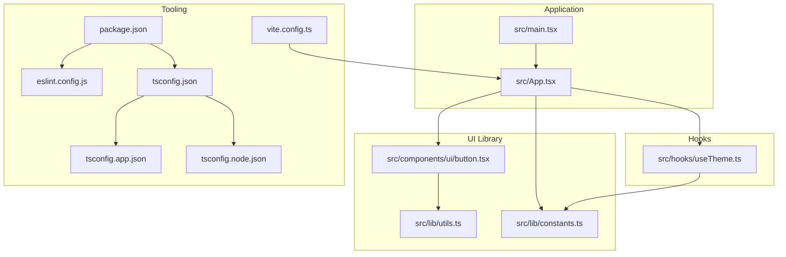
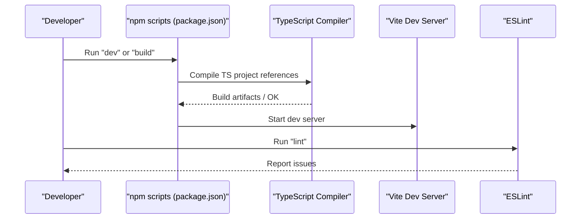
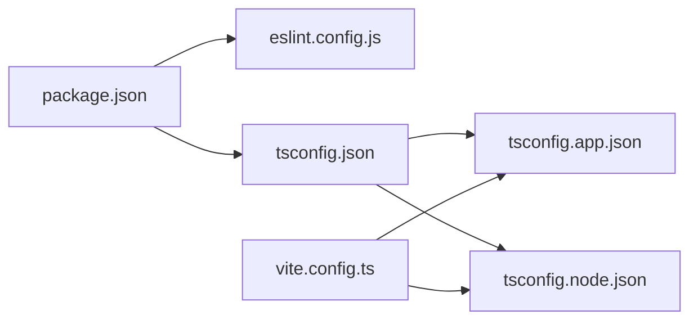

# Coding Standards & Configuration

<cite>
**Referenced Files in This Document**
- [package.json](file://package.json)
- [eslint.config.js](file://eslint.config.js)
- [tsconfig.json](file://tsconfig.json)
- [tsconfig.app.json](file://tsconfig.app.json)
- [tsconfig.node.json](file://tsconfig.node.json)
- [vite.config.ts](file://vite.config.ts)
- [README.md](file://README.md)
- [src/main.tsx](file://src/main.tsx)
- [src/App.tsx](file://src/App.tsx)
- [src/lib/utils.ts](file://src/lib/utils.ts)
- [src/lib/constants.ts](file://src/lib/constants.ts)
- [src/hooks/useTheme.ts](file://src/hooks/useTheme.ts)
- [src/components/ui/button.tsx](file://src/components/ui/button.tsx)
</cite>

## Table of Contents
1. [Introduction](#introduction)
2. [Project Structure](#project-structure)
3. [Core Components](#core-components)
4. [Architecture Overview](#architecture-overview)
5. [Detailed Component Analysis](#detailed-component-analysis)
6. [Dependency Analysis](#dependency-analysis)
7. [Performance Considerations](#performance-considerations)
8. [Troubleshooting Guide](#troubleshooting-guide)
9. [Conclusion](#conclusion)
10. [Appendices](#appendices)

## Introduction
This document defines the coding standards and configuration for RedRep with a focus on TypeScript, ESLint, and the development environment. It consolidates the current setup and provides practical guidelines for consistent development, including strict type checking, module resolution, target environment settings, linting patterns, naming conventions, import/export organization, formatting, error handling, logging, debugging, code review, and pull request expectations.

## Project Structure
RedRep follows a conventional React + TypeScript + Vite project layout with a modular component library under src/components and feature modules under src/features. Utility helpers live under src/lib, hooks under src/hooks, and the application entrypoint under src/main.tsx. Configuration is centralized via TypeScript project references, Vite configuration, and ESLint flat config.

**Diagram sources**
- [src/main.tsx:1-11](file://src/main.tsx#L1-L11)
- [src/App.tsx:1-139](file://src/App.tsx#L1-L139)
- [src/components/ui/button.tsx:1-59](file://src/components/ui/button.tsx#L1-L59)
- [src/lib/utils.ts:1-7](file://src/lib/utils.ts#L1-L7)
- [src/lib/constants.ts:1-85](file://src/lib/constants.ts#L1-L85)
- [src/hooks/useTheme.ts:1-70](file://src/hooks/useTheme.ts#L1-L70)
- [package.json:1-45](file://package.json#L1-L45)
- [eslint.config.js:1-23](file://eslint.config.js#L1-L23)
- [tsconfig.json:1-13](file://tsconfig.json#L1-L13)
- [tsconfig.app.json:1-31](file://tsconfig.app.json#L1-L31)
- [tsconfig.node.json:1-25](file://tsconfig.node.json#L1-L25)
- [vite.config.ts:1-15](file://vite.config.ts#L1-L15)

**Section sources**
- [package.json:1-45](file://package.json#L1-L45)
- [tsconfig.json:1-13](file://tsconfig.json#L1-L13)
- [tsconfig.app.json:1-31](file://tsconfig.app.json#L1-L31)
- [tsconfig.node.json:1-25](file://tsconfig.node.json#L1-L25)
- [vite.config.ts:1-15](file://vite.config.ts#L1-L15)
- [eslint.config.js:1-23](file://eslint.config.js#L1-L23)

## Core Components
- TypeScript configuration
  - Project references: app and node configurations are combined via tsconfig.json.
  - Target environment: ES2023 for both app and node.
  - Module resolution: bundler mode with verbatim module syntax and forced module detection.
  - JSX: react-jsx for React components.
  - Aliasing: @/* resolves to src/.
  - Strictness: unused locals/parameters, erasable syntax only, switch fall-through checks.
- ESLint configuration
  - Flat config extending recommended sets for JS, TS, React Hooks, and React Refresh.
  - Browser globals enabled for client-side linting.
  - Files scoped to TypeScript/TSX.
- Vite configuration
  - React plugin and Tailwind Vite plugin.
  - Alias @ pointing to src/.

**Section sources**
- [tsconfig.json:1-13](file://tsconfig.json#L1-L13)
- [tsconfig.app.json:1-31](file://tsconfig.app.json#L1-L31)
- [tsconfig.node.json:1-25](file://tsconfig.node.json#L1-L25)
- [eslint.config.js:1-23](file://eslint.config.js#L1-L23)
- [vite.config.ts:1-15](file://vite.config.ts#L1-L15)

## Architecture Overview
The build and lint pipeline integrates TypeScript compilation, Vite bundling, and ESLint checks. The app entry renders the root React element and mounts the App component, which composes UI primitives and feature logic.

**Diagram sources**
- [package.json:6-11](file://package.json#L6-L11)
- [tsconfig.json:3-6](file://tsconfig.json#L3-L6)
- [vite.config.ts:7-8](file://vite.config.ts#L7-L8)
- [eslint.config.js:8-22](file://eslint.config.js#L8-L22)

## Detailed Component Analysis

### TypeScript Configuration Standards
- Strict type checking
  - Prefer enabling type-checked ESLint configs for enhanced safety. See recommended updates in the project README for type-aware lint rules.
- Module resolution and bundler mode
  - Use bundler module resolution with verbatim module syntax and forced detection to align with modern toolchains.
- Target environment
  - Keep ES2023 targets for app and node to leverage contemporary JavaScript features.
- JSX and path aliases
  - Configure JSX transform for React and maintain @/* alias for clean imports.
- Linting flags
  - Keep unused locals/parameters checks, erasable syntax enforcement, and switch fall-through checks enabled.

**Section sources**
- [tsconfig.app.json:4-16](file://tsconfig.app.json#L4-L16)
- [tsconfig.app.json:18-27](file://tsconfig.app.json#L18-L27)
- [tsconfig.node.json:4-15](file://tsconfig.node.json#L4-L15)
- [tsconfig.node.json:17-21](file://tsconfig.node.json#L17-L21)
- [tsconfig.json:8-10](file://tsconfig.json#L8-L10)
- [README.md:14-44](file://README.md#L14-L44)

### ESLint Configuration Patterns
- React + TypeScript + Hooks + Refresh
  - Current setup extends recommended configs for JS, TS, React Hooks, and React Refresh.
- Type-aware linting (recommended)
  - For production-grade applications, switch to type-checked ESLint configs and configure parser projects to both tsconfig files.
- React-specific plugins (optional)
  - Consider adding React-specific plugins for deeper React linting coverage.

**Section sources**
- [eslint.config.js:8-22](file://eslint.config.js#L8-L22)
- [README.md:14-73](file://README.md#L14-L73)

### Naming Conventions
- Files and components
  - Use PascalCase for component filenames (e.g., Button.tsx).
  - Use kebab-case for non-component files (e.g., utils.ts).
- Variables and constants
  - Use camelCase for variables and constants.
  - Use UPPER_SNAKE_CASE for static configuration constants.
- Types and interfaces
  - Use PascalCase for type names and interface names.
- Directories
  - Use plural nouns for feature directories (e.g., features/home).
  - Use descriptive singular nouns for shared utilities (e.g., hooks, lib).

**Section sources**
- [src/components/ui/button.tsx:1-59](file://src/components/ui/button.tsx#L1-L59)
- [src/lib/constants.ts:76-84](file://src/lib/constants.ts#L76-L84)
- [src/lib/utils.ts:1-7](file://src/lib/utils.ts#L1-L7)

### Import/Export Patterns and Module Organization
- Prefer explicit relative imports for local modules.
- Use absolute imports via @/* alias for cleaner imports from src/.
- Export only what is necessary; prefer named exports for utilities and default exports for components.
- Group imports by external libraries, then internal aliases, then relative paths.

Examples to reference:
- Absolute import usage in App.tsx and Button.tsx.
- Utility function import in Button.tsx.

**Section sources**
- [src/App.tsx:1-7](file://src/App.tsx#L1-L7)
- [src/components/ui/button.tsx:1-4](file://src/components/ui/button.tsx#L1-L4)
- [vite.config.ts:9-12](file://vite.config.ts#L9-L12)
- [tsconfig.app.json:18-21](file://tsconfig.app.json#L18-L21)

### Code Formatting Standards (Prettier Integration)
- Integrate Prettier with ESLint to enforce formatting consistently.
- Configure Prettier to co-exist with TypeScript and React JSX formatting rules.
- Add a pre-commit hook to run formatting automatically.

[No sources needed since this section provides general guidance]

### Linting Rules for React Components, TypeScript Interfaces, and Styling Consistency
- React components
  - Enforce hooks rules and refresh-related rules via the installed plugins.
  - Consider adding React-specific plugins for additional React linting.
- TypeScript interfaces
  - Use interfaces for object shapes; use types for primitive unions and mapped types.
  - Keep interfaces small and composable; prefer readonly where appropriate.
- Styling consistency
  - Centralize design tokens in constants and utility functions to ensure consistent spacing, typography, and colors.
  - Use className composition utilities to keep styles predictable.

**Section sources**
- [eslint.config.js:3-6](file://eslint.config.js#L3-L6)
- [src/lib/constants.ts:6-84](file://src/lib/constants.ts#L6-L84)
- [src/lib/utils.ts:4-6](file://src/lib/utils.ts#L4-L6)

### Error Handling, Logging, and Debugging Practices
- Error handling
  - Wrap potentially failing operations (e.g., localStorage) in try/catch blocks and fail gracefully.
- Logging
  - Use console APIs sparingly; prefer structured logs in development and integrate a dedicated logger in production.
- Debugging
  - Use React Developer Tools and browser devtools.
  - Leverage TypeScript’s strictness to catch errors early.

Example references:
- Theme hook wraps localStorage operations in try/catch.
- App component uses Tailwind utility classes for consistent styling.

**Section sources**
- [src/hooks/useTheme.ts:32-36](file://src/hooks/useTheme.ts#L32-L36)
- [src/App.tsx:12-134](file://src/App.tsx#L12-L134)

### Code Review Standards and Pull Request Requirements
- PR checklist
  - All lint checks pass locally.
  - Build succeeds without errors.
  - New or changed logic includes tests where applicable.
  - Changes are covered by meaningful commit messages and PR descriptions.
- Review guidelines
  - Focus on correctness, readability, performance, and adherence to naming/import conventions.
  - Ensure new dependencies are justified and vetted.

[No sources needed since this section provides general guidance]

## Dependency Analysis
The project’s toolchain relies on Vite for dev/build, TypeScript for type checking, and ESLint for code quality. Aliasing and module resolution are coordinated across Vite and TypeScript configurations.

**Diagram sources**
- [package.json:1-45](file://package.json#L1-L45)
- [eslint.config.js:1-23](file://eslint.config.js#L1-L23)
- [tsconfig.json:1-13](file://tsconfig.json#L1-L13)
- [tsconfig.app.json:1-31](file://tsconfig.app.json#L1-L31)
- [tsconfig.node.json:1-25](file://tsconfig.node.json#L1-L25)
- [vite.config.ts:1-15](file://vite.config.ts#L1-L15)

**Section sources**
- [package.json:1-45](file://package.json#L1-L45)
- [vite.config.ts:1-15](file://vite.config.ts#L1-L15)
- [tsconfig.json:1-13](file://tsconfig.json#L1-L13)

## Performance Considerations
- Keep TypeScript targets at ES2023 to benefit from modern runtime features.
- Use bundler module resolution to optimize tree-shaking and reduce bundle size.
- Minimize unnecessary re-renders by leveraging memoization and stable callbacks in hooks.

[No sources needed since this section provides general guidance]

## Troubleshooting Guide
- ESLint type-aware rules not working
  - Ensure parserOptions point to both tsconfig files and that you are using a type-checked ESLint configuration.
- Import alias not resolving
  - Verify the @ alias is defined in both Vite and TypeScript configurations.
- Build failures after adding new files
  - Confirm new files are included in the relevant tsconfig include patterns.

**Section sources**
- [README.md:14-44](file://README.md#L14-L44)
- [vite.config.ts:9-12](file://vite.config.ts#L9-L12)
- [tsconfig.app.json:29-31](file://tsconfig.app.json#L29-L31)
- [tsconfig.node.json:23-24](file://tsconfig.node.json#L23-L24)

## Conclusion
RedRep’s current configuration establishes a strong foundation for a modern React + TypeScript + Vite project. By adopting type-aware linting, enforcing strict TypeScript flags, and maintaining consistent naming and import patterns, the team can scale development while preserving code quality and developer productivity.

[No sources needed since this section summarizes without analyzing specific files]

## Appendices

### Example: Properly Configured Files
- TypeScript app configuration
  - Target, module resolution, JSX, and path aliases are defined.
  - Unused locals/parameters and switch fall-through checks are enabled.
  - Reference: [tsconfig.app.json:1-31](file://tsconfig.app.json#L1-L31)
- TypeScript node configuration
  - Target, module resolution, and lint flags aligned with app config.
  - Reference: [tsconfig.node.json:1-25](file://tsconfig.node.json#L1-L25)
- ESLint configuration
  - Extends recommended configs for JS, TS, React Hooks, and React Refresh.
  - Reference: [eslint.config.js:1-23](file://eslint.config.js#L1-L23)
- Vite configuration
  - Plugins and alias for @ resolved to src/.
  - Reference: [vite.config.ts:1-15](file://vite.config.ts#L1-L15)
- Application entrypoint
  - Strict mode, root rendering, and CSS import.
  - Reference: [src/main.tsx:1-11](file://src/main.tsx#L1-L11)
- App component
  - Uses absolute imports, UI components, and constants.
  - Reference: [src/App.tsx:1-139](file://src/App.tsx#L1-L139)
- Utility function
  - Composition of clsx and tailwind-merge.
  - Reference: [src/lib/utils.ts:1-7](file://src/lib/utils.ts#L1-L7)
- Hook with error handling
  - Try/catch around localStorage and media query listeners.
  - Reference: [src/hooks/useTheme.ts:1-70](file://src/hooks/useTheme.ts#L1-L70)
- UI component with variants
  - Uses cva and className composition.
  - Reference: [src/components/ui/button.tsx:1-59](file://src/components/ui/button.tsx#L1-L59)

### Common Violations to Avoid
- Mixing relative and absolute imports inconsistently within the same module.
- Using var instead of const/let for variables.
- Declaring unused variables or parameters.
- Omitting type annotations for props in React components.
- Adding files outside of configured include patterns causing build/lint failures.

**Section sources**
- [tsconfig.app.json:24-27](file://tsconfig.app.json#L24-L27)
- [tsconfig.node.json:18-21](file://tsconfig.node.json#L18-L21)
- [src/App.tsx:1-7](file://src/App.tsx#L1-L7)
- [src/components/ui/button.tsx:1-4](file://src/components/ui/button.tsx#L1-L4)
- [src/hooks/useTheme.ts:32-36](file://src/hooks/useTheme.ts#L32-L36)