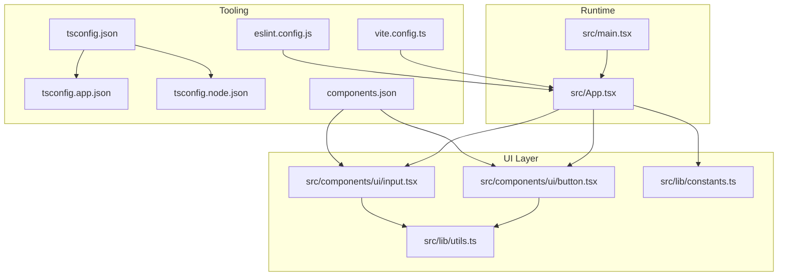
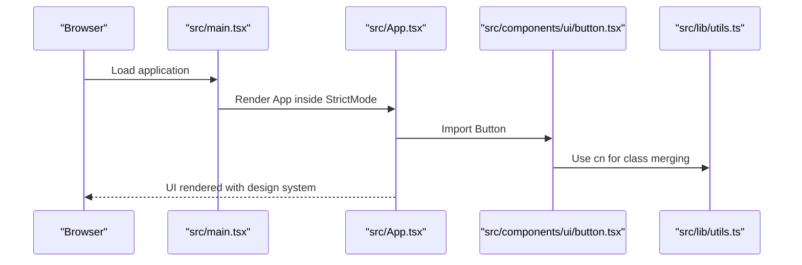
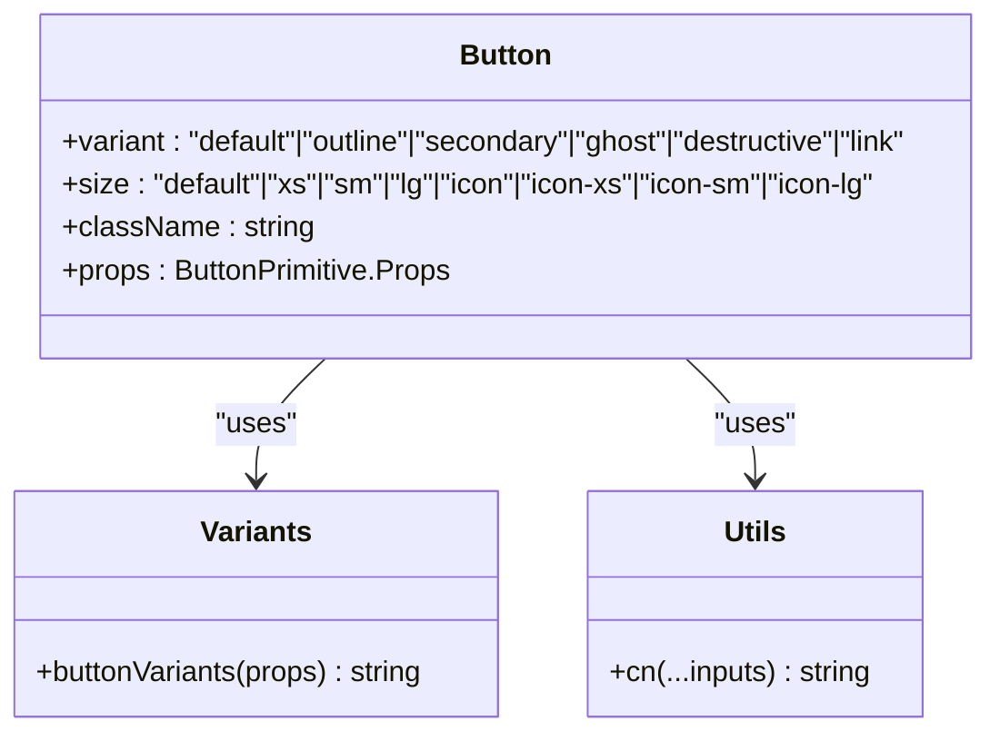
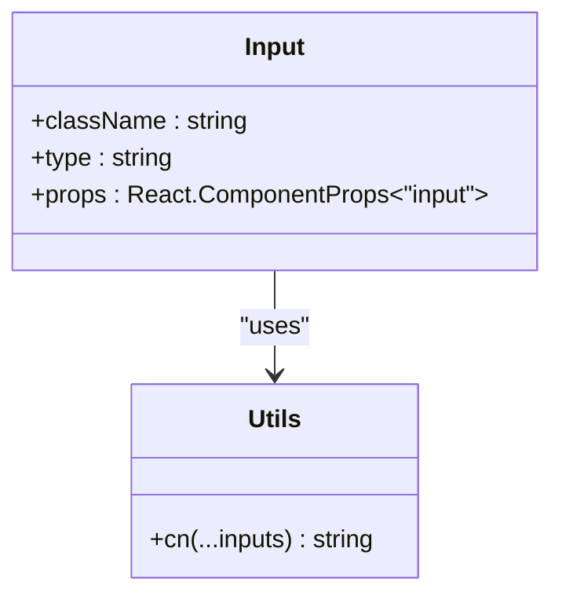
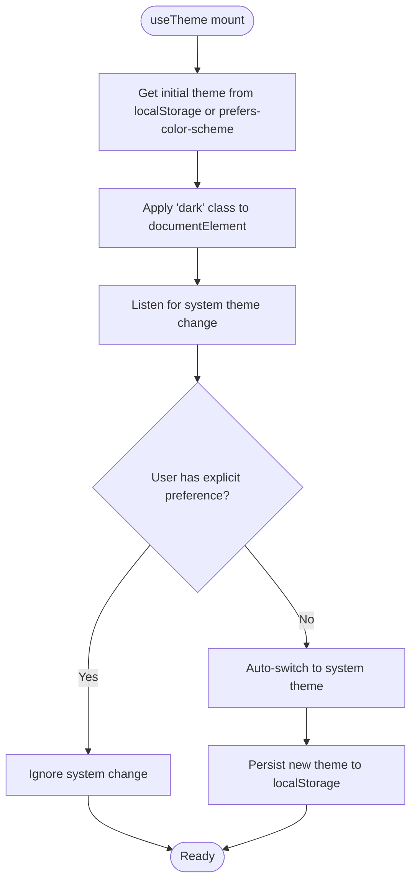
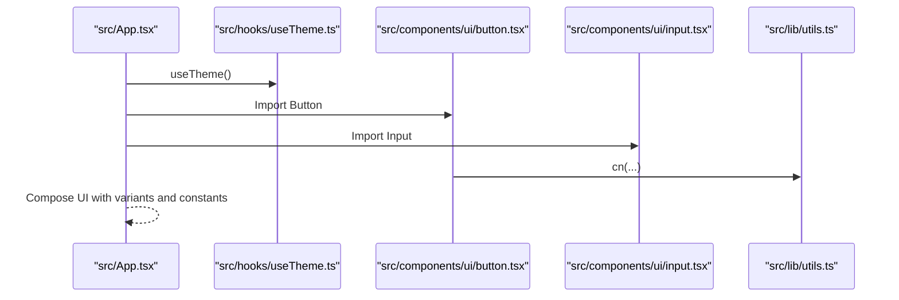
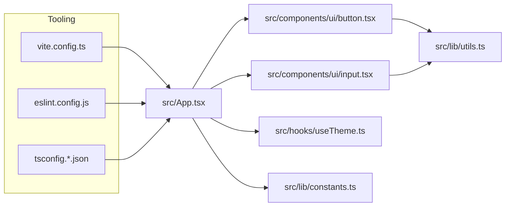

# Development Guidelines

<cite>
**Referenced Files in This Document**
- [package.json](file://package.json)
- [vite.config.ts](file://vite.config.ts)
- [tsconfig.json](file://tsconfig.json)
- [tsconfig.app.json](file://tsconfig.app.json)
- [tsconfig.node.json](file://tsconfig.node.json)
- [eslint.config.js](file://eslint.config.js)
- [README.md](file://README.md)
- [components.json](file://components.json)
- [src/main.tsx](file://src/main.tsx)
- [src/App.tsx](file://src/App.tsx)
- [src/lib/utils.ts](file://src/lib/utils.ts)
- [src/lib/constants.ts](file://src/lib/constants.ts)
- [src/hooks/useTheme.ts](file://src/hooks/useTheme.ts)
- [src/components/ui/button.tsx](file://src/components/ui/button.tsx)
- [src/components/ui/input.tsx](file://src/components/ui/input.tsx)
</cite>

## Table of Contents
1. [Introduction](#introduction)
2. [Project Structure](#project-structure)
3. [Core Components](#core-components)
4. [Architecture Overview](#architecture-overview)
5. [Detailed Component Analysis](#detailed-component-analysis)
6. [Dependency Analysis](#dependency-analysis)
7. [Performance Considerations](#performance-considerations)
8. [Testing Strategies](#testing-strategies)
9. [Accessibility and Inclusive Design](#accessibility-and-inclusive-design)
10. [Deployment and Build Optimization](#deployment-and-build-optimization)
11. [Troubleshooting Guide](#troubleshooting-guide)
12. [Conclusion](#conclusion)

## Introduction
This document provides comprehensive development guidelines for RedRep, focusing on coding standards, best practices, and development workflows. It explains TypeScript configuration and type safety enforcement, ESLint configuration and recommended rules, component development patterns, utility architecture, integration with shadcn/ui and Base UI React, testing strategies, performance optimization, accessibility, and deployment preparation.

## Project Structure
RedRep follows a modular, feature-oriented structure with a clear separation of concerns:
- src/components/ui: Reusable design system components built with Base UI React and styled via Tailwind CSS and class variance authority.
- src/components/shared and src/components/layout: Shared and layout components used across features.
- src/features: Feature modules (e.g., home, preview).
- src/hooks: Custom React hooks (e.g., theme management).
- src/lib: Utilities and constants supporting the design system and component styling.
- Root configuration files define TypeScript, ESLint, Vite, and component library configuration.

**Diagram sources**
- [src/main.tsx:1-11](file://src/main.tsx#L1-L11)
- [src/App.tsx:1-139](file://src/App.tsx#L1-L139)
- [src/components/ui/button.tsx:1-59](file://src/components/ui/button.tsx#L1-L59)
- [src/components/ui/input.tsx:1-21](file://src/components/ui/input.tsx#L1-L21)
- [src/lib/utils.ts:1-7](file://src/lib/utils.ts#L1-L7)
- [src/lib/constants.ts:1-85](file://src/lib/constants.ts#L1-L85)
- [vite.config.ts:1-15](file://vite.config.ts#L1-L15)
- [tsconfig.json:1-13](file://tsconfig.json#L1-L13)
- [tsconfig.app.json:1-31](file://tsconfig.app.json#L1-L31)
- [tsconfig.node.json:1-25](file://tsconfig.node.json#L1-L25)
- [eslint.config.js:1-23](file://eslint.config.js#L1-L23)
- [components.json:1-26](file://components.json#L1-L26)

**Section sources**
- [package.json:1-45](file://package.json#L1-L45)
- [vite.config.ts:1-15](file://vite.config.ts#L1-L15)
- [tsconfig.json:1-13](file://tsconfig.json#L1-L13)
- [tsconfig.app.json:1-31](file://tsconfig.app.json#L1-L31)
- [tsconfig.node.json:1-25](file://tsconfig.node.json#L1-L25)
- [eslint.config.js:1-23](file://eslint.config.js#L1-L23)
- [components.json:1-26](file://components.json#L1-L26)

## Core Components
- Utility functions: A centralized cn function merges Tailwind classes safely using clsx and tailwind-merge.
- Constants and design tokens: Typography, spacing, motion, z-index, breakpoints, categories, and app configuration.
- Theme hook: Provides theme state, persistence, and system preference synchronization.
- UI primitives: Components built on Base UI React primitives with variant-driven styling via class-variance-authority.

Best practices:
- Prefer default exports for single-purpose UI primitives.
- Use VariantProps for variant typing and enforce defaults via cva.
- Centralize styling logic in cn and keep component props minimal and typed.

**Section sources**
- [src/lib/utils.ts:1-7](file://src/lib/utils.ts#L1-L7)
- [src/lib/constants.ts:1-85](file://src/lib/constants.ts#L1-L85)
- [src/hooks/useTheme.ts:1-70](file://src/hooks/useTheme.ts#L1-L70)
- [src/components/ui/button.tsx:1-59](file://src/components/ui/button.tsx#L1-L59)
- [src/components/ui/input.tsx:1-21](file://src/components/ui/input.tsx#L1-L21)

## Architecture Overview
The runtime initializes the app with strict mode, mounts the root element, and renders the main App. App composes UI primitives and demonstrates the design system. Tooling integrates React Fast Refresh, Tailwind v4, and TypeScript for type-safe builds.

**Diagram sources**
- [src/main.tsx:1-11](file://src/main.tsx#L1-L11)
- [src/App.tsx:1-139](file://src/App.tsx#L1-L139)
- [src/components/ui/button.tsx:1-59](file://src/components/ui/button.tsx#L1-L59)
- [src/lib/utils.ts:1-7](file://src/lib/utils.ts#L1-L7)

**Section sources**
- [src/main.tsx:1-11](file://src/main.tsx#L1-L11)
- [src/App.tsx:1-139](file://src/App.tsx#L1-L139)

## Detailed Component Analysis

### Button Component
The Button component wraps a Base UI Button primitive, applies variant-driven styles via class-variance-authority, and merges Tailwind classes with cn. It exposes variant and size props with sensible defaults and forwards all other props to the primitive.

**Diagram sources**
- [src/components/ui/button.tsx:1-59](file://src/components/ui/button.tsx#L1-L59)
- [src/lib/utils.ts:1-7](file://src/lib/utils.ts#L1-L7)

Implementation highlights:
- Variant props typing via VariantProps ensures compile-time correctness.
- Defaults are applied through cva defaultVariants.
- data-slot attributes standardize composition with composite widgets.

**Section sources**
- [src/components/ui/button.tsx:1-59](file://src/components/ui/button.tsx#L1-L59)

### Input Component
The Input component wraps a Base UI Input primitive, applying standardized styling and forwarding props. It uses cn for safe class merging and data-slot for composition.

**Diagram sources**
- [src/components/ui/input.tsx:1-21](file://src/components/ui/input.tsx#L1-L21)
- [src/lib/utils.ts:1-7](file://src/lib/utils.ts#L1-L7)

**Section sources**
- [src/components/ui/input.tsx:1-21](file://src/components/ui/input.tsx#L1-L21)

### Theme Hook
The useTheme hook manages theme state, persists preferences to localStorage, and synchronizes with system preferences. It toggles a dark class on the root element and exposes typed theme state.

**Diagram sources**
- [src/hooks/useTheme.ts:1-70](file://src/hooks/useTheme.ts#L1-L70)

**Section sources**
- [src/hooks/useTheme.ts:1-70](file://src/hooks/useTheme.ts#L1-L70)

### App Composition
The App component demonstrates the design system by rendering themed buttons, badges, typography, and color palettes. It integrates the theme toggle and showcases component variants.

**Diagram sources**
- [src/App.tsx:1-139](file://src/App.tsx#L1-L139)
- [src/hooks/useTheme.ts:1-70](file://src/hooks/useTheme.ts#L1-L70)
- [src/components/ui/button.tsx:1-59](file://src/components/ui/button.tsx#L1-L59)
- [src/components/ui/input.tsx:1-21](file://src/components/ui/input.tsx#L1-L21)
- [src/lib/utils.ts:1-7](file://src/lib/utils.ts#L1-L7)

**Section sources**
- [src/App.tsx:1-139](file://src/App.tsx#L1-L139)

## Dependency Analysis
External libraries and their roles:
- Base UI React: Primitive components for accessible, unstyled foundations.
- shadcn/ui: Design system configuration and component aliases.
- Tailwind CSS v4: Utility-first styling with CSS variables and merge utilities.
- Framer Motion: Motion primitives for animations.
- class-variance-authority and clsx/tailwind-merge: Type-safe variant composition and class merging.
- React Router DOM: Routing for multi-page-like navigation.
- Vite + @vitejs/plugin-react + @tailwindcss/vite: Build toolchain and CSS integration.

**Diagram sources**
- [src/App.tsx:1-139](file://src/App.tsx#L1-L139)
- [src/components/ui/button.tsx:1-59](file://src/components/ui/button.tsx#L1-L59)
- [src/components/ui/input.tsx:1-21](file://src/components/ui/input.tsx#L1-L21)
- [src/lib/utils.ts:1-7](file://src/lib/utils.ts#L1-L7)
- [src/hooks/useTheme.ts:1-70](file://src/hooks/useTheme.ts#L1-L70)
- [src/lib/constants.ts:1-85](file://src/lib/constants.ts#L1-L85)
- [vite.config.ts:1-15](file://vite.config.ts#L1-L15)
- [eslint.config.js:1-23](file://eslint.config.js#L1-L23)
- [tsconfig.json:1-13](file://tsconfig.json#L1-L13)

**Section sources**
- [package.json:1-45](file://package.json#L1-L45)
- [components.json:1-26](file://components.json#L1-L26)

## Performance Considerations
- Memoization: Wrap expensive components with memoization to prevent unnecessary re-renders. Use shallow comparisons for props and avoid passing new object/array literals as inline props.
- Lazy loading: Defer heavy components or routes using dynamic imports to reduce initial bundle size.
- Bundle size management: Prefer tree-shaking-friendly libraries, remove unused dependencies, and leverage Vite’s native splitting. Audit bundles with profiling tools.
- Rendering: Minimize reflows by batching state updates and avoiding layout thrashing. Use CSS containment for heavy sections.
- Animations: Use hardware-accelerated properties (transform/opacity) and limit expensive effects.

[No sources needed since this section provides general guidance]

## Testing Strategies
Recommended patterns:
- Unit tests for pure functions and hooks using a testing framework with React 19 support.
- Component tests with lightweight renderers, mocking external services, and asserting on snapshots or behavior.
- Accessibility tests using automated tools to check ARIA roles and keyboard navigation.
- Integration tests for routing and feature flows.

[No sources needed since this section provides general guidance]

## Accessibility and Inclusive Design
Guidelines:
- Use semantic HTML and ARIA attributes where appropriate.
- Ensure sufficient color contrast and avoid conveying meaning through color alone.
- Support keyboard navigation and focus management.
- Provide text alternatives for non-text content and ensure screen reader compatibility.
- Test with assistive technologies and automated accessibility checks.

[No sources needed since this section provides general guidance]

## Deployment and Build Optimization
Preparation steps:
- Run type checks and linters before building.
- Build with Vite for optimized production bundles.
- Verify asset paths and public resources.
- Configure environment variables and feature flags for production.
- Monitor bundle size and optimize dependencies.

[No sources needed since this section provides general guidance]

## Troubleshooting Guide
Common areas to inspect:
- TypeScript diagnostics for unused locals/parameters and switch coverage.
- ESLint configuration for React and TypeScript rules.
- Vite plugin resolution and Tailwind integration.
- Theme persistence and system preference handling.

**Section sources**
- [tsconfig.app.json:23-27](file://tsconfig.app.json#L23-L27)
- [tsconfig.node.json:17-21](file://tsconfig.node.json#L17-L21)
- [eslint.config.js:1-23](file://eslint.config.js#L1-L23)
- [vite.config.ts:1-15](file://vite.config.ts#L1-L15)
- [src/hooks/useTheme.ts:1-70](file://src/hooks/useTheme.ts#L1-L70)

## Conclusion
These guidelines establish a consistent foundation for building RedRep with strong type safety, maintainable component architecture, and accessible UI. By adhering to the patterns outlined here—component composition, variant-driven styling, utility-first class merging, and robust tooling—you can scale the design system while preserving performance and usability.