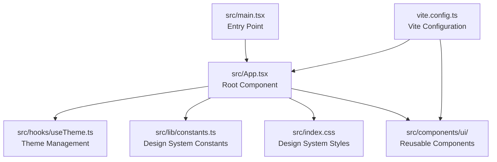
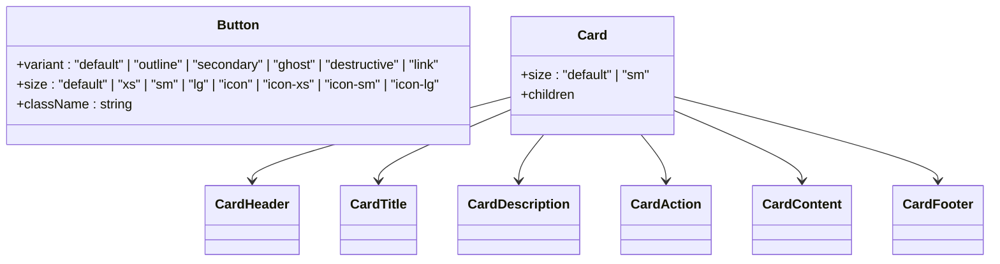

# Getting Started

<cite>
**Referenced Files in This Document**
- [README.md](file://README.md)
- [package.json](file://package.json)
- [vite.config.ts](file://vite.config.ts)
- [src/main.tsx](file://src/main.tsx)
- [src/App.tsx](file://src/App.tsx)
- [src/index.css](file://src/index.css)
- [src/lib/constants.ts](file://src/lib/constants.ts)
- [src/hooks/useTheme.ts](file://src/hooks/useTheme.ts)
- [src/components/ui/button.tsx](file://src/components/ui/button.tsx)
- [src/components/ui/card.tsx](file://src/components/ui/card.tsx)
</cite>

## Table of Contents
1. [Introduction](#introduction)
2. [Prerequisites](#prerequisites)
3. [Installation](#installation)
4. [Development Workflow](#development-workflow)
5. [Project Structure](#project-structure)
6. [Quick Start Examples](#quick-start-examples)
7. [Exploring the Component Library](#exploring-the-component-library)
8. [Troubleshooting Guide](#troubleshooting-guide)
9. [Conclusion](#conclusion)

## Introduction
This guide helps you get up and running with RedRep quickly. RedRep is a modern React application built with TypeScript and Vite, featuring a comprehensive component library designed for rapid development and consistent design. The project serves dual purposes:
- As a standalone application showcasing the design system and components
- As a reusable component library that you can integrate into other projects

You will learn how to install dependencies, start the development server, explore the component library, and understand the project structure that supports both application development and component library distribution.

## Prerequisites
Before installing and running RedRep, ensure you have:
- Node.js installed (version compatible with the project’s package manager requirements)
- Familiarity with npm or yarn for dependency management
- Basic understanding of React and TypeScript fundamentals
- A terminal or command prompt to run commands

These requirements align with the project’s configuration and dependencies.

**Section sources**
- [package.json:1-45](file://package.json#L1-L45)

## Installation
Follow these steps to install and set up RedRep locally:

1. Clone the repository to your local machine using Git.
2. Navigate to the project directory in your terminal.
3. Install dependencies using your preferred package manager:
   - npm: Run the install script defined in the project.
   - yarn: Use yarn to install dependencies.
4. After installation completes, you can proceed to start the development server.

Environment setup is handled automatically by the project configuration, including TypeScript compilation and Vite bundling.

Verification:
- Confirm that the development server starts without errors.
- Open the application in your browser to verify the UI renders correctly.

**Section sources**
- [package.json:6-11](file://package.json#L6-L11)
- [vite.config.ts:1-15](file://vite.config.ts#L1-L15)

## Development Workflow
The project provides scripts for common development tasks. Use these commands during development:

- Start the development server with hot module replacement (HMR):
  - npm: Run the dev script.
  - yarn: Use the dev script.
- Build the application for production:
  - npm: Run the build script.
  - yarn: Use the build script.
- Preview the production build locally:
  - npm: Run the preview script.
  - yarn: Use the preview script.
- Run linter checks:
  - npm: Run the lint script.
  - yarn: Use the lint script.

These scripts streamline development, testing, and previewing your work.

**Section sources**
- [package.json:6-11](file://package.json#L6-L11)

## Project Structure
RedRep organizes code into feature-focused directories and a well-defined component library:

- src/main.tsx: Application entry point that mounts the root React component.
- src/App.tsx: Root component rendering the application shell, theme controls, hero section, and design system showcase.
- src/index.css: Tailwind v4-based design system with light/dark themes, typography, animations, and utility classes.
- src/lib/constants.ts: Centralized design system constants including fonts, spacing, motion, z-index, breakpoints, categories, and app configuration.
- src/hooks/useTheme.ts: Theme management hook supporting light/dark modes, system preference detection, and persistence.
- src/components/ui/: Reusable UI primitives and composite components (e.g., Button, Card) built with shadcn/ui and Base Web components.
- vite.config.ts: Vite configuration enabling React plugin, Tailwind CSS integration, and path aliases for clean imports.

This structure supports both application development and serving as a component library for external consumption.

**Diagram sources**
- [src/main.tsx:1-11](file://src/main.tsx#L1-L11)
- [src/App.tsx:1-139](file://src/App.tsx#L1-L139)
- [src/hooks/useTheme.ts:1-70](file://src/hooks/useTheme.ts#L1-L70)
- [src/lib/constants.ts:1-85](file://src/lib/constants.ts#L1-L85)
- [src/index.css:1-402](file://src/index.css#L1-L402)
- [vite.config.ts:1-15](file://vite.config.ts#L1-L15)

**Section sources**
- [src/main.tsx:1-11](file://src/main.tsx#L1-L11)
- [src/App.tsx:1-139](file://src/App.tsx#L1-L139)
- [src/index.css:1-402](file://src/index.css#L1-L402)
- [src/lib/constants.ts:1-85](file://src/lib/constants.ts#L1-L85)
- [src/hooks/useTheme.ts:1-70](file://src/hooks/useTheme.ts#L1-L70)
- [vite.config.ts:1-15](file://vite.config.ts#L1-L15)

## Quick Start Examples
To verify your setup and explore the application:

1. Start the development server:
   - npm: Run the dev script.
   - yarn: Use the dev script.
2. Open the application in your browser and confirm:
   - The theme toggle switches between light and dark modes.
   - The hero section displays the application name, tagline, and description.
   - The design system preview showcases color palettes, typography, and component samples.
3. Explore the component library:
   - Review the Button and Card components showcased in the root component.
   - Inspect the component variants and sizes demonstrated in the UI preview.

Local deployment verification:
- Use the preview script to serve the production build locally and confirm asset loading and routing.

**Section sources**
- [package.json:6-11](file://package.json#L6-L11)
- [src/App.tsx:8-139](file://src/App.tsx#L8-L139)
- [src/components/ui/button.tsx:1-59](file://src/components/ui/button.tsx#L1-L59)
- [src/components/ui/card.tsx:1-104](file://src/components/ui/card.tsx#L1-L104)

## Exploring the Component Library
RedRep includes a robust component library designed for reusability and consistency:

- Button: A versatile primitive with multiple variants and sizes, styled using class variance authority and integrated with the design system tokens.
- Card: A flexible container with header, title, description, action, content, and footer slots, supporting responsive sizing and semantic structure.

You can explore these components in the application preview and use them in your own projects by importing from the component library.

**Diagram sources**
- [src/components/ui/button.tsx:43-59](file://src/components/ui/button.tsx#L43-L59)
- [src/components/ui/card.tsx:5-103](file://src/components/ui/card.tsx#L5-L103)

**Section sources**
- [src/components/ui/button.tsx:1-59](file://src/components/ui/button.tsx#L1-L59)
- [src/components/ui/card.tsx:1-104](file://src/components/ui/card.tsx#L1-L104)

## Troubleshooting Guide
Common setup issues and resolutions:

- Node.js version conflicts:
  - Ensure your Node.js version meets the project’s requirements. If you encounter compatibility errors, update Node.js to a supported version.
- Package manager issues:
  - Clear the package cache and reinstall dependencies if you see permission or lockfile errors.
- Port conflicts during development:
  - If the default port is in use, configure a different port in the Vite configuration.
- Missing environment variables:
  - Verify that environment variables are correctly configured if your project requires them.
- Browser caching problems:
  - Hard refresh the page or disable cache temporarily to ensure you are seeing the latest changes.
- Operating system-specific issues:
  - On Windows, ensure you are using a compatible terminal and that file permissions are not blocking installations.
  - On macOS/Linux, verify that executable permissions are set correctly for scripts if needed.

If problems persist, review the Vite configuration and dependency versions to ensure compatibility.

**Section sources**
- [vite.config.ts:1-15](file://vite.config.ts#L1-L15)
- [package.json:1-45](file://package.json#L1-L45)

## Conclusion
You are now ready to develop with RedRep. Use the development scripts to start the server, explore the component library, and build your application. The project’s structure supports both application development and serving as a reusable component library. Refer to the troubleshooting guide if you encounter issues, and consult the component library documentation for advanced usage.