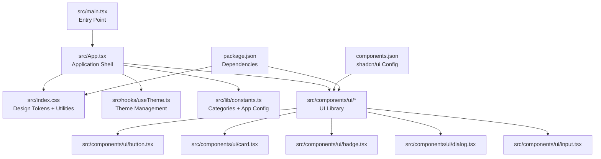
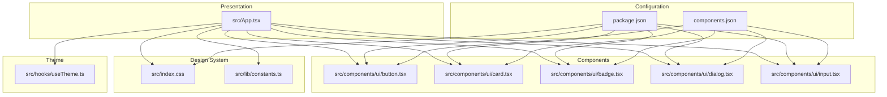
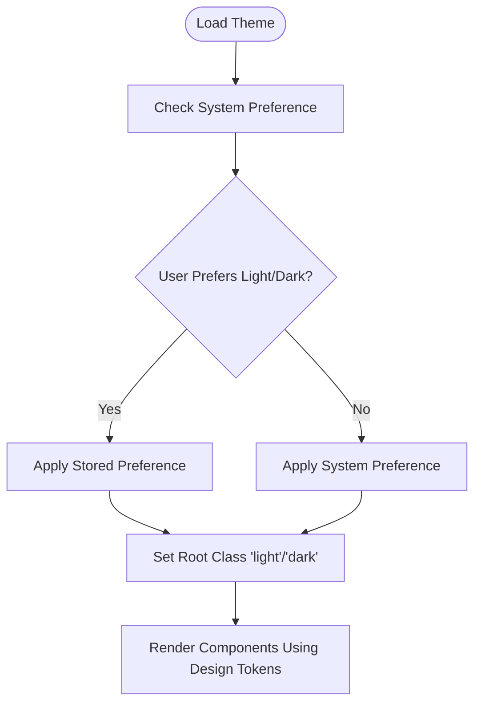
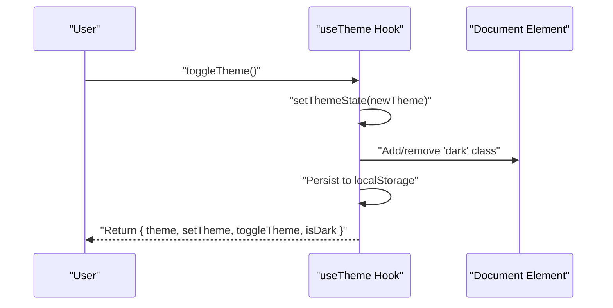
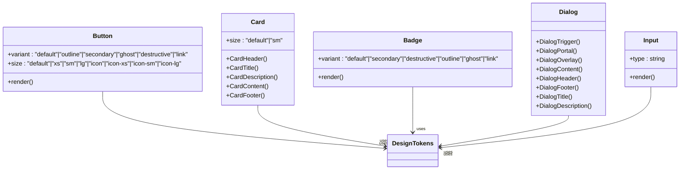
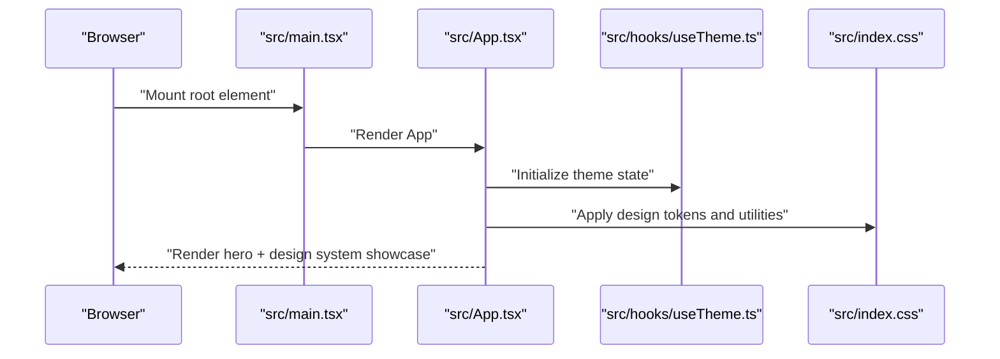
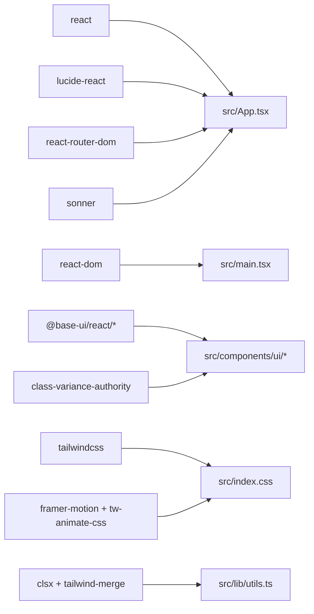

# Project Overview

<cite>
**Referenced Files in This Document**
- [README.md](file://README.md)
- [package.json](file://package.json)
- [src/App.tsx](file://src/App.tsx)
- [src/main.tsx](file://src/main.tsx)
- [src/index.css](file://src/index.css)
- [src/lib/constants.ts](file://src/lib/constants.ts)
- [src/hooks/useTheme.ts](file://src/hooks/useTheme.ts)
- [src/lib/utils.ts](file://src/lib/utils.ts)
- [src/components/ui/button.tsx](file://src/components/ui/button.tsx)
- [src/components/ui/card.tsx](file://src/components/ui/card.tsx)
- [src/components/ui/badge.tsx](file://src/components/ui/badge.tsx)
- [src/components/ui/dialog.tsx](file://src/components/ui/dialog.tsx)
- [src/components/ui/input.tsx](file://src/components/ui/input.tsx)
- [components.json](file://components.json)
</cite>

## Table of Contents
1. [Introduction](#introduction)
2. [Project Structure](#project-structure)
3. [Core Components](#core-components)
4. [Architecture Overview](#architecture-overview)
5. [Detailed Component Analysis](#detailed-component-analysis)
6. [Dependency Analysis](#dependency-analysis)
7. [Performance Considerations](#performance-considerations)
8. [Troubleshooting Guide](#troubleshooting-guide)
9. [Conclusion](#conclusion)

## Introduction
RedRep is a dual-purpose project: a functional React application and a comprehensive UI component library. It serves as both a demonstration playground for the "Scholarly Neon" design system and a foundation for an educational Q&A platform. The design system centers on scholarly aesthetics with a retro-futuristic twist—neon color schemes, glass morphism effects, animated gradients, and carefully curated typography. The platform targets academic communities seeking a modern, visually engaging interface for peer-to-peer question-and-answer interactions.

The project’s architecture combines React 19, TypeScript, Tailwind CSS v4, and modern design system principles. It leverages design tokens for consistent theming, a robust component library built with Base Web and shadcn/ui-inspired primitives, and utility-first styling to deliver a cohesive visual identity. The result is a system that is both visually compelling and highly maintainable, suitable for rapid iteration in an educational domain.

## Project Structure
At a high level, the project is organized into:
- Application shell and routing entry point
- Design system and theme engine
- UI component library (Base Web primitives with design token integration)
- Feature showcases and constants for categories and app configuration
- Build-time configuration for Tailwind v4 and shadcn/ui compatibility

**Diagram sources**
- [src/main.tsx:1-11](file://src/main.tsx#L1-L11)
- [src/App.tsx:1-139](file://src/App.tsx#L1-L139)
- [src/index.css:1-402](file://src/index.css#L1-L402)
- [src/hooks/useTheme.ts:1-70](file://src/hooks/useTheme.ts#L1-L70)
- [src/lib/constants.ts:1-85](file://src/lib/constants.ts#L1-L85)
- [src/components/ui/button.tsx:1-59](file://src/components/ui/button.tsx#L1-L59)
- [src/components/ui/card.tsx:1-104](file://src/components/ui/card.tsx#L1-L104)
- [src/components/ui/badge.tsx:1-53](file://src/components/ui/badge.tsx#L1-L53)
- [src/components/ui/dialog.tsx:1-161](file://src/components/ui/dialog.tsx#L1-L161)
- [src/components/ui/input.tsx:1-21](file://src/components/ui/input.tsx#L1-L21)
- [components.json:1-26](file://components.json#L1-L26)
- [package.json:1-45](file://package.json#L1-L45)

**Section sources**
- [src/main.tsx:1-11](file://src/main.tsx#L1-L11)
- [src/App.tsx:1-139](file://src/App.tsx#L1-L139)
- [src/index.css:1-402](file://src/index.css#L1-L402)
- [src/lib/constants.ts:1-85](file://src/lib/constants.ts#L1-L85)
- [components.json:1-26](file://components.json#L1-L26)
- [package.json:1-45](file://package.json#L1-L45)

## Core Components
RedRep’s core identity emerges from three pillars:
- Design tokens and theme engine: Centralized color palettes, typography, spacing, motion, and z-index scales define the "Scholarly Neon" aesthetic.
- UI component library: Reusable, accessible primitives that integrate with design tokens and support variants for consistent usage across the app.
- Application shell: A showcase page that demonstrates the design system, gradients, glass morphism, and component samples.

Key highlights:
- Design tokens: Colors, fonts, spacing rhythm, motion durations, z-index scale, and breakpoints are defined centrally for reuse and consistency.
- Theme engine: A theme hook manages light/dark modes, persists preferences, and syncs with system settings.
- Component library: Buttons, cards, badges, dialogs, inputs, and more are built with class variance authority and integrate seamlessly with Tailwind v4 tokens.
- Visual identity: Gradient mesh backgrounds, gradient text, glass morphism overlays, and subtle animations reinforce the retro-futuristic look.

Practical examples:
- Gradient mesh hero background and animated gradients are applied via utility classes and CSS keyframes defined in the design system.
- Glass morphism is achieved through utility classes that apply backdrop blur, borders, and translucent backgrounds.
- Component samples in the showcase include buttons, badges, and typography to illustrate the design system in action.

**Section sources**
- [src/lib/constants.ts:1-85](file://src/lib/constants.ts#L1-L85)
- [src/hooks/useTheme.ts:1-70](file://src/hooks/useTheme.ts#L1-L70)
- [src/components/ui/button.tsx:1-59](file://src/components/ui/button.tsx#L1-L59)
- [src/components/ui/card.tsx:1-104](file://src/components/ui/card.tsx#L1-L104)
- [src/components/ui/badge.tsx:1-53](file://src/components/ui/badge.tsx#L1-L53)
- [src/components/ui/dialog.tsx:1-161](file://src/components/ui/dialog.tsx#L1-L161)
- [src/components/ui/input.tsx:1-21](file://src/components/ui/input.tsx#L1-L21)
- [src/index.css:285-401](file://src/index.css#L285-L401)
- [src/App.tsx:26-128](file://src/App.tsx#L26-L128)

## Architecture Overview
RedRep follows a layered architecture:
- Presentation layer: React components and pages that render the application shell and showcase the design system.
- Design system layer: CSS-based design tokens, animations, and utilities that provide a consistent visual language.
- Component library layer: Primitive UI components built with Base Web and styled via design tokens.
- Theme layer: A theme hook that manages color modes and persists user preferences.
- Configuration layer: Package dependencies, Tailwind v4 setup, and shadcn/ui alignment.

**Diagram sources**
- [src/App.tsx:1-139](file://src/App.tsx#L1-L139)
- [src/index.css:1-402](file://src/index.css#L1-L402)
- [src/lib/constants.ts:1-85](file://src/lib/constants.ts#L1-L85)
- [src/components/ui/button.tsx:1-59](file://src/components/ui/button.tsx#L1-L59)
- [src/components/ui/card.tsx:1-104](file://src/components/ui/card.tsx#L1-L104)
- [src/components/ui/badge.tsx:1-53](file://src/components/ui/badge.tsx#L1-L53)
- [src/components/ui/dialog.tsx:1-161](file://src/components/ui/dialog.tsx#L1-L161)
- [src/components/ui/input.tsx:1-21](file://src/components/ui/input.tsx#L1-L21)
- [src/hooks/useTheme.ts:1-70](file://src/hooks/useTheme.ts#L1-L70)
- [package.json:1-45](file://package.json#L1-L45)
- [components.json:1-26](file://components.json#L1-L26)

## Detailed Component Analysis

### Design System: Scholarly Neon
The "Scholarly Neon" design system is implemented through:
- Color tokens: Brand, surfaces, accents, semantic colors, and sidebar tokens defined for both light and dark modes.
- Typography tokens: Display, body, and mono fonts integrated via CSS variables and Tailwind v4 theme inline.
- Motion tokens: Animation durations for transitions, entrance effects, gradient mesh, and floating elements.
- Utilities: Gradient mesh backgrounds, gradient text, glass morphism overlays, surface elevation, grain textures, and staggered animations.

**Diagram sources**
- [src/hooks/useTheme.ts:6-66](file://src/hooks/useTheme.ts#L6-L66)
- [src/index.css:94-192](file://src/index.css#L94-L192)

**Section sources**
- [src/index.css:10-89](file://src/index.css#L10-L89)
- [src/index.css:94-192](file://src/index.css#L94-L192)
- [src/index.css:285-401](file://src/index.css#L285-L401)
- [src/lib/constants.ts:13-51](file://src/lib/constants.ts#L13-L51)

### Theme Engine: useTheme Hook
The theme hook encapsulates:
- Initial theme detection from local storage or system preference.
- Runtime switching between light and dark themes.
- Persistence of user preferences.
- Event listener for system theme changes with guard against manual overrides.

**Diagram sources**
- [src/hooks/useTheme.ts:19-66](file://src/hooks/useTheme.ts#L19-L66)

**Section sources**
- [src/hooks/useTheme.ts:1-70](file://src/hooks/useTheme.ts#L1-L70)

### UI Component Library: Button, Card, Badge, Dialog, Input
The component library integrates design tokens and variant systems:
- Button: Variants (default, outline, secondary, ghost, destructive, link) and sizes with focus, disabled, and invalid states.
- Card: Structured composition with header, title, description, content, and footer slots, plus size variants.
- Badge: Lightweight indicator with variants and icon support.
- Dialog: Composable dialog primitive with overlay, portal, content, header, footer, title, and description.
- Input: Styled input primitive with focus, disabled, and invalid states.

**Diagram sources**
- [src/components/ui/button.tsx:6-41](file://src/components/ui/button.tsx#L6-L41)
- [src/components/ui/card.tsx:5-93](file://src/components/ui/card.tsx#L5-L93)
- [src/components/ui/badge.tsx:7-28](file://src/components/ui/badge.tsx#L7-L28)
- [src/components/ui/dialog.tsx:10-147](file://src/components/ui/dialog.tsx#L10-L147)
- [src/components/ui/input.tsx:6-17](file://src/components/ui/input.tsx#L6-L17)

**Section sources**
- [src/components/ui/button.tsx:1-59](file://src/components/ui/button.tsx#L1-L59)
- [src/components/ui/card.tsx:1-104](file://src/components/ui/card.tsx#L1-L104)
- [src/components/ui/badge.tsx:1-53](file://src/components/ui/badge.tsx#L1-L53)
- [src/components/ui/dialog.tsx:1-161](file://src/components/ui/dialog.tsx#L1-L161)
- [src/components/ui/input.tsx:1-21](file://src/components/ui/input.tsx#L1-L21)

### Application Shell: Showcase and Visual Identity
The application shell demonstrates:
- Hero section with gradient mesh background and animated text.
- Design system preview: color palette, typography, and component samples.
- Footer with tech stack attribution.

**Diagram sources**
- [src/main.tsx:6-10](file://src/main.tsx#L6-L10)
- [src/App.tsx:8-136](file://src/App.tsx#L8-L136)
- [src/hooks/useTheme.ts:19-66](file://src/hooks/useTheme.ts#L19-L66)
- [src/index.css:10-89](file://src/index.css#L10-L89)

**Section sources**
- [src/App.tsx:1-139](file://src/App.tsx#L1-L139)
- [src/main.tsx:1-11](file://src/main.tsx#L1-L11)

## Dependency Analysis
External dependencies and their roles:
- React 19 and React DOM: Core rendering and runtime.
- Base Web primitives: Accessible UI primitives for components like button, dialog, input, and avatar.
- Tailwind CSS v4: Utility-first styling with design token bridges and animations.
- Class variance authority and clsx/tailwind-merge: Consistent variant composition and class merging.
- Framer Motion and tw-animate-css: Motion primitives and animation utilities.
- Lucide React: Icons for UI elements.
- Router and notifications: Navigation and toast feedback.

**Diagram sources**
- [package.json:12-26](file://package.json#L12-L26)
- [src/App.tsx:1-6](file://src/App.tsx#L1-L6)
- [src/main.tsx:1-4](file://src/main.tsx#L1-L4)
- [src/components/ui/button.tsx:1-4](file://src/components/ui/button.tsx#L1-L4)
- [src/lib/utils.ts:1-7](file://src/lib/utils.ts#L1-L7)
- [src/index.css:1-1](file://src/index.css#L1-L1)

**Section sources**
- [package.json:1-45](file://package.json#L1-L45)
- [src/lib/utils.ts:1-7](file://src/lib/utils.ts#L1-L7)

## Performance Considerations
- CSS-in-JS and design tokens: Centralized tokens minimize repaints and improve maintainability.
- Utility-first approach: Tailwind v4 reduces bundle bloat by generating only used styles.
- Motion primitives: Use reduced motion settings and avoid heavy animations for accessibility and performance.
- Component composition: Keep variants lean and avoid excessive nesting to reduce re-renders.
- Theme persistence: Local storage usage is lightweight but consider debouncing frequent toggles.

## Troubleshooting Guide
Common issues and resolutions:
- Theme not persisting: Verify local storage availability and that the theme key matches the configured value.
- Fonts not loading: Ensure external font links are present and fonts are declared in design tokens.
- Animations not playing: Confirm CSS keyframes are defined and animation utilities are applied.
- Component variants not applying: Check variant composition and ensure class merging utilities are used consistently.

**Section sources**
- [src/hooks/useTheme.ts:6-17](file://src/hooks/useTheme.ts#L6-L17)
- [src/index.css:54-89](file://src/index.css#L54-L89)
- [src/lib/utils.ts:4-6](file://src/lib/utils.ts#L4-L6)

## Conclusion
RedRep exemplifies a modern, design-driven React application that doubles as a comprehensive UI component library. Its "Scholarly Neon" design system blends scholarly aesthetics with neon color schemes, glass morphism, and animated gradients, tailored for academic communities. By leveraging React 19, TypeScript, Tailwind CSS v4, and a robust design token architecture, the project delivers a visually cohesive and highly maintainable foundation for an educational Q&A platform. The showcased components and utilities demonstrate how design tokens and primitives can be composed to create a consistent, accessible, and engaging user experience.