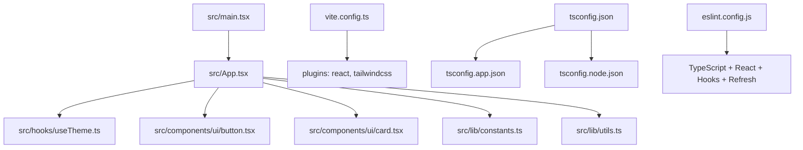
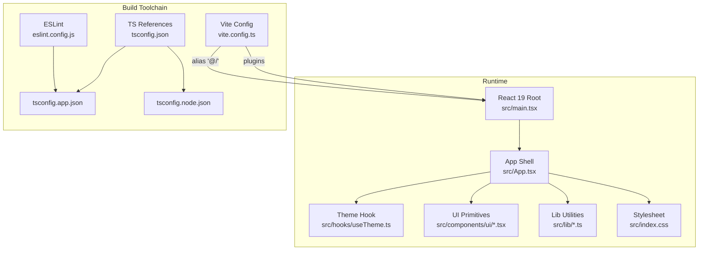
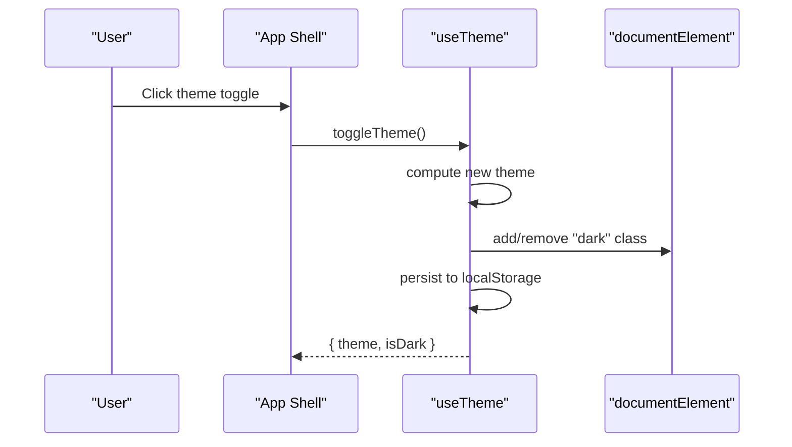
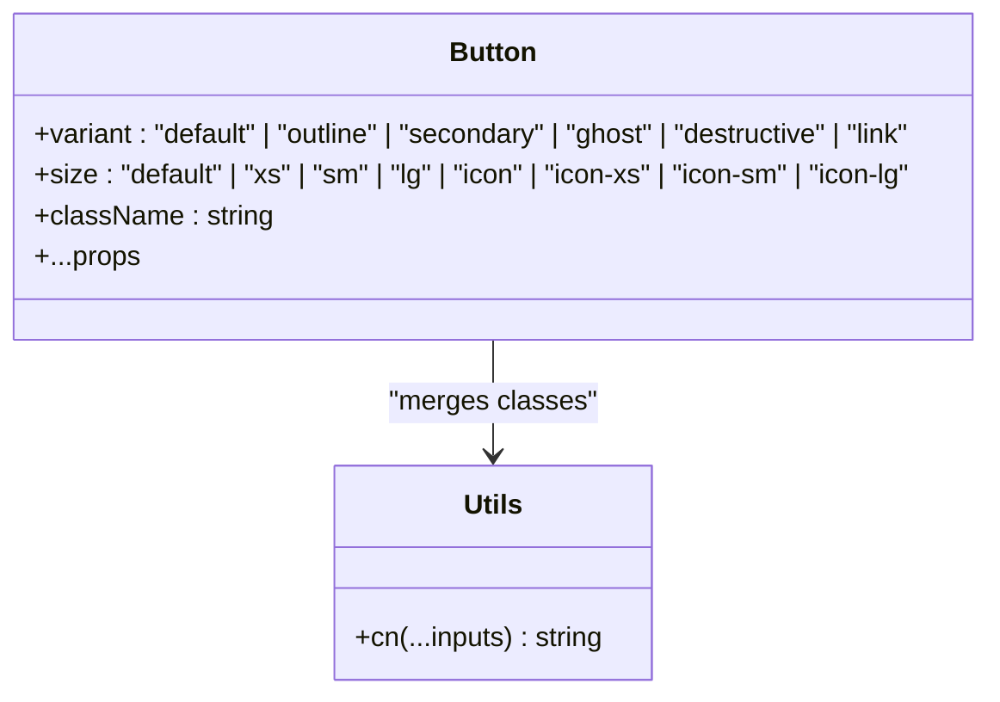
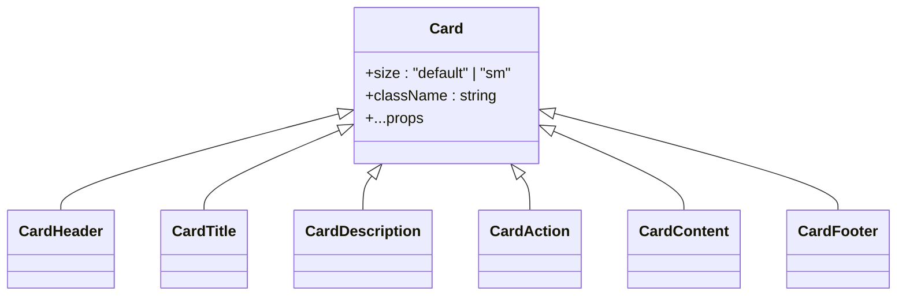
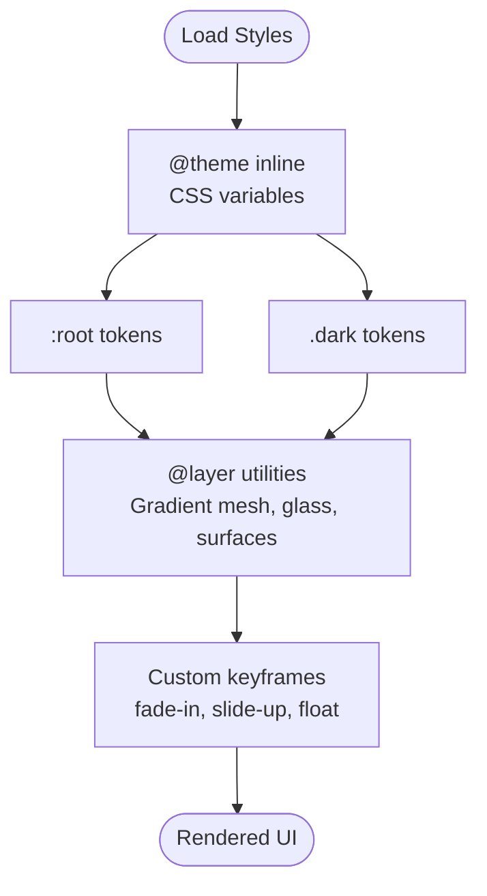
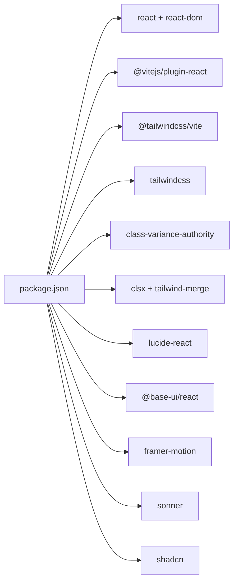

# Technical Architecture

<cite>
**Referenced Files in This Document**
- [package.json](file://package.json)
- [vite.config.ts](file://vite.config.ts)
- [tsconfig.json](file://tsconfig.json)
- [tsconfig.app.json](file://tsconfig.app.json)
- [tsconfig.node.json](file://tsconfig.node.json)
- [eslint.config.js](file://eslint.config.js)
- [components.json](file://components.json)
- [src/main.tsx](file://src/main.tsx)
- [src/App.tsx](file://src/App.tsx)
- [src/hooks/useTheme.ts](file://src/hooks/useTheme.ts)
- [src/lib/constants.ts](file://src/lib/constants.ts)
- [src/lib/utils.ts](file://src/lib/utils.ts)
- [src/components/ui/button.tsx](file://src/components/ui/button.tsx)
- [src/components/ui/card.tsx](file://src/components/ui/card.tsx)
- [src/index.css](file://src/index.css)
- [README.md](file://README.md)
</cite>

## Table of Contents
1. [Introduction](#introduction)
2. [Project Structure](#project-structure)
3. [Core Components](#core-components)
4. [Architecture Overview](#architecture-overview)
5. [Detailed Component Analysis](#detailed-component-analysis)
6. [Dependency Analysis](#dependency-analysis)
7. [Performance Considerations](#performance-considerations)
8. [Asset Management](#asset-management)
9. [Routing and Navigation](#routing-and-navigation)
10. [Testing and CI](#testing-and-ci)
11. [Scalability and Evolution](#scalability-and-evolution)
12. [Troubleshooting Guide](#troubleshooting-guide)
13. [Conclusion](#conclusion)

## Introduction
This document describes the technical foundation and system design patterns of RedRep, a React 19 application built with Vite, TypeScript, Tailwind CSS v4, and a curated component library. The architecture emphasizes:
- Component composition via a design system with variant-driven UI primitives
- Theme management with persistent user preferences and system-aware switching
- Asset-first styling with Tailwind v4 tokens and CSS animations
- Developer productivity with strict TypeScript configuration and ESLint
- Scalable file organization supporting both application pages and a reusable component library

## Project Structure
The project follows a feature-centric, component-library-first organization:
- src/main.tsx initializes the React root and mounts App
- src/App.tsx orchestrates the theme toggle, hero section, and design system showcase
- src/components/ui contains reusable, variant-driven UI primitives (e.g., Button, Card)
- src/hooks provides domain/state utilities (e.g., useTheme)
- src/lib defines constants, utilities, and shared helpers
- src/index.css defines the design system tokens, animations, and layering
- Vite and TypeScript configurations enable efficient builds and type safety

**Diagram sources**
- [src/main.tsx:1-11](file://src/main.tsx#L1-L11)
- [src/App.tsx:1-139](file://src/App.tsx#L1-L139)
- [src/hooks/useTheme.ts:1-70](file://src/hooks/useTheme.ts#L1-L70)
- [src/components/ui/button.tsx:1-59](file://src/components/ui/button.tsx#L1-L59)
- [src/components/ui/card.tsx:1-104](file://src/components/ui/card.tsx#L1-L104)
- [src/lib/constants.ts:1-85](file://src/lib/constants.ts#L1-L85)
- [src/lib/utils.ts:1-7](file://src/lib/utils.ts#L1-L7)
- [vite.config.ts:1-15](file://vite.config.ts#L1-L15)
- [tsconfig.json:1-13](file://tsconfig.json#L1-L13)
- [tsconfig.app.json:1-31](file://tsconfig.app.json#L1-L31)
- [tsconfig.node.json:1-25](file://tsconfig.node.json#L1-L25)
- [eslint.config.js:1-23](file://eslint.config.js#L1-L23)

**Section sources**
- [src/main.tsx:1-11](file://src/main.tsx#L1-L11)
- [src/App.tsx:1-139](file://src/App.tsx#L1-L139)
- [vite.config.ts:1-15](file://vite.config.ts#L1-L15)
- [tsconfig.json:1-13](file://tsconfig.json#L1-L13)
- [tsconfig.app.json:1-31](file://tsconfig.app.json#L1-L31)
- [tsconfig.node.json:1-25](file://tsconfig.node.json#L1-L25)
- [eslint.config.js:1-23](file://eslint.config.js#L1-L23)
- [components.json:1-26](file://components.json#L1-L26)

## Core Components
- Theme hook: Manages light/dark mode, persists user preference, and syncs with system preference
- Design system constants: Typography, spacing, motion, z-index, breakpoints, categories, and app config
- Utility functions: Class merging with clsx and tailwind-merge
- UI primitives: Button and Card with variant and size systems powered by class-variance-authority and Tailwind v4

Key implementation patterns:
- Variant-driven UI: Base UI primitives accept variant and size props with strongly typed options
- Token-driven theming: CSS variables bridge Tailwind v4 tokens to React components
- Composition over inheritance: Components expose data-slot attributes and className merging for extensibility

**Section sources**
- [src/hooks/useTheme.ts:1-70](file://src/hooks/useTheme.ts#L1-L70)
- [src/lib/constants.ts:1-85](file://src/lib/constants.ts#L1-L85)
- [src/lib/utils.ts:1-7](file://src/lib/utils.ts#L1-L7)
- [src/components/ui/button.tsx:1-59](file://src/components/ui/button.tsx#L1-L59)
- [src/components/ui/card.tsx:1-104](file://src/components/ui/card.tsx#L1-L104)

## Architecture Overview
The runtime architecture centers on a single-page application bootstrapped by Vite and React 19. The build pipeline leverages Vite with React plugin and Tailwind CSS v4 integration. TypeScript compiles with separate app and node configurations. The UI layer is a composable design system with theme-aware tokens and animations.

**Diagram sources**
- [src/main.tsx:1-11](file://src/main.tsx#L1-L11)
- [src/App.tsx:1-139](file://src/App.tsx#L1-L139)
- [src/hooks/useTheme.ts:1-70](file://src/hooks/useTheme.ts#L1-L70)
- [src/components/ui/button.tsx:1-59](file://src/components/ui/button.tsx#L1-L59)
- [src/components/ui/card.tsx:1-104](file://src/components/ui/card.tsx#L1-L104)
- [src/lib/constants.ts:1-85](file://src/lib/constants.ts#L1-L85)
- [src/lib/utils.ts:1-7](file://src/lib/utils.ts#L1-L7)
- [src/index.css:1-402](file://src/index.css#L1-L402)
- [vite.config.ts:1-15](file://vite.config.ts#L1-L15)
- [tsconfig.json:1-13](file://tsconfig.json#L1-L13)
- [tsconfig.app.json:1-31](file://tsconfig.app.json#L1-L31)
- [tsconfig.node.json:1-25](file://tsconfig.node.json#L1-L25)
- [eslint.config.js:1-23](file://eslint.config.js#L1-L23)

## Detailed Component Analysis

### Theme Management
The theme system encapsulates:
- Initial theme detection from local storage or prefers-color-scheme
- Runtime switching with DOM class toggling and persistence
- System preference listener with manual override awareness
- Immutable return shape for consumers

**Diagram sources**
- [src/App.tsx:14-24](file://src/App.tsx#L14-L24)
- [src/hooks/useTheme.ts:39-41](file://src/hooks/useTheme.ts#L39-L41)
- [src/hooks/useTheme.ts:22-37](file://src/hooks/useTheme.ts#L22-L37)
- [src/hooks/useTheme.ts:54-66](file://src/hooks/useTheme.ts#L54-L66)

**Section sources**
- [src/hooks/useTheme.ts:1-70](file://src/hooks/useTheme.ts#L1-L70)
- [src/App.tsx:14-24](file://src/App.tsx#L14-L24)

### UI Primitive: Button
The Button primitive demonstrates:
- Variant and size variants driven by class-variance-authority
- Strongly typed props with defaults
- className merging via cn
- Base UI integration for accessible semantics

**Diagram sources**
- [src/components/ui/button.tsx:6-41](file://src/components/ui/button.tsx#L6-L41)
- [src/lib/utils.ts:4-6](file://src/lib/utils.ts#L4-L6)

**Section sources**
- [src/components/ui/button.tsx:1-59](file://src/components/ui/button.tsx#L1-L59)
- [src/lib/utils.ts:1-7](file://src/lib/utils.ts#L1-L7)

### UI Primitive: Card
The Card primitive showcases:
- Size variants and slot-based composition
- Data attributes for styling hooks
- Consistent spacing and typography tokens

**Diagram sources**
- [src/components/ui/card.tsx:5-21](file://src/components/ui/card.tsx#L5-L21)
- [src/components/ui/card.tsx:23-34](file://src/components/ui/card.tsx#L23-L34)
- [src/components/ui/card.tsx:36-47](file://src/components/ui/card.tsx#L36-L47)
- [src/components/ui/card.tsx:49-57](file://src/components/ui/card.tsx#L49-L57)
- [src/components/ui/card.tsx:72-93](file://src/components/ui/card.tsx#L72-L93)

**Section sources**
- [src/components/ui/card.tsx:1-104](file://src/components/ui/card.tsx#L1-L104)

### Design System Tokens and Animations
The stylesheet defines:
- Tailwind v4 token bridge via @theme inline
- Light and dark themes with oklch color tokens
- Utility classes for gradients, glassmorphism, elevation, grain overlay, and staggered animations
- Responsive section spacing and reduced-motion support

**Diagram sources**
- [src/index.css:10-89](file://src/index.css#L10-L89)
- [src/index.css:94-192](file://src/index.css#L94-L192)
- [src/index.css:285-401](file://src/index.css#L285-L401)

**Section sources**
- [src/index.css:1-402](file://src/index.css#L1-L402)
- [src/lib/constants.ts:6-31](file://src/lib/constants.ts#L6-L31)

## Dependency Analysis
External dependencies and their roles:
- React 19 and React DOM: Application runtime
- @vitejs/plugin-react: Fast JSX transform and HMR
- @tailwindcss/vite: Tailwind v4 integration
- Tailwind CSS v4: Utility-first styling engine
- class-variance-authority and clsx/tailwind-merge: Variant-driven class composition
- lucide-react: Icons
- @base-ui/react: Accessible base components
- framer-motion: Motion primitives
- sonner: Toast notifications
- shadcn: Component registry configuration

**Diagram sources**
- [package.json:12-26](file://package.json#L12-L26)
- [package.json:27-42](file://package.json#L27-L42)

**Section sources**
- [package.json:1-45](file://package.json#L1-L45)
- [components.json:1-26](file://components.json#L1-L26)

## Performance Considerations
- Build-time
  - Vite with React plugin for fast dev server and optimized production bundles
  - Tailwind v4 with JIT-like processing via the Vite plugin
  - TypeScript references split app and node configs for faster incremental builds
- Runtime
  - CSS variable-based theme switching avoids reflows
  - Utility-first CSS minimizes bundle weight
  - Motion utilities use hardware-accelerated properties
- Recommendations
  - Lazy-load non-critical routes and components
  - Split vendor chunks for frequently updated libraries
  - Use CSS containment and reduced-motion checks for accessibility

[No sources needed since this section provides general guidance]

## Asset Management
- Static assets: Place under public/ for direct URL access
- Fonts: Linked via index.html for optimal performance; CSS variables reference font families
- Icons: lucide-react components imported directly
- Animations: CSS keyframes and Tailwind utilities for motion primitives
- Theming: CSS variables switch between light and dark palettes

**Section sources**
- [src/index.css:8-52](file://src/index.css#L8-L52)
- [src/App.tsx:27-44](file://src/App.tsx#L27-L44)

## Routing and Navigation
The current application does not include route definitions. Navigation patterns can be introduced using the installed router dependency while maintaining the existing component library and theme system.

[No sources needed since this section doesn't analyze specific files]

## Testing and CI
No test framework or CI configuration was found in the repository. Recommended approach:
- Add Vitest or Jest with React Testing Library for unit and component tests
- Integrate Playwright or Cypress for E2E testing
- Configure GitHub Actions or similar for automated linting, type checking, and tests on pull requests

[No sources needed since this section doesn't analyze specific files]

## Scalability and Evolution
- File organization supports expanding features under features/ and growing the component library under components/ui/
- Variant-driven primitives encourage consistent extension without duplicating styles
- CSS token bridge enables easy theme customization and brand evolution
- TypeScript references and ESLint promote maintainability as the codebase grows

[No sources needed since this section provides general guidance]

## Troubleshooting Guide
Common issues and remedies:
- Theme not persisting: Verify localStorage availability and APP_CONFIG.themeKey correctness
- Styles not applying: Ensure Tailwind plugin is active and CSS variables match Tailwind v4 tokens
- Type errors: Confirm tsconfig references and bundler module resolution settings
- ESLint errors: Align parserOptions projects with tsconfig references

**Section sources**
- [src/hooks/useTheme.ts:10-16](file://src/hooks/useTheme.ts#L10-L16)
- [src/hooks/useTheme.ts:32-36](file://src/hooks/useTheme.ts#L32-L36)
- [tsconfig.json:3-6](file://tsconfig.json#L3-L6)
- [eslint.config.js:18-21](file://eslint.config.js#L18-L21)

## Conclusion
RedRep’s architecture combines a modern build toolchain (Vite), a robust type system (TypeScript), and a flexible design system (Tailwind v4 + Base UI + shadcn) to deliver a scalable, theme-aware React application. The component library-first approach, variant-driven UI primitives, and token-based theming provide a strong foundation for future feature additions and consistent visual design.