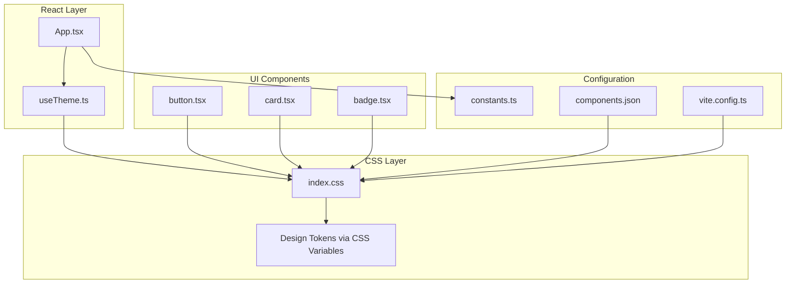
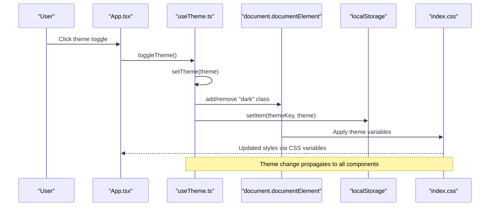
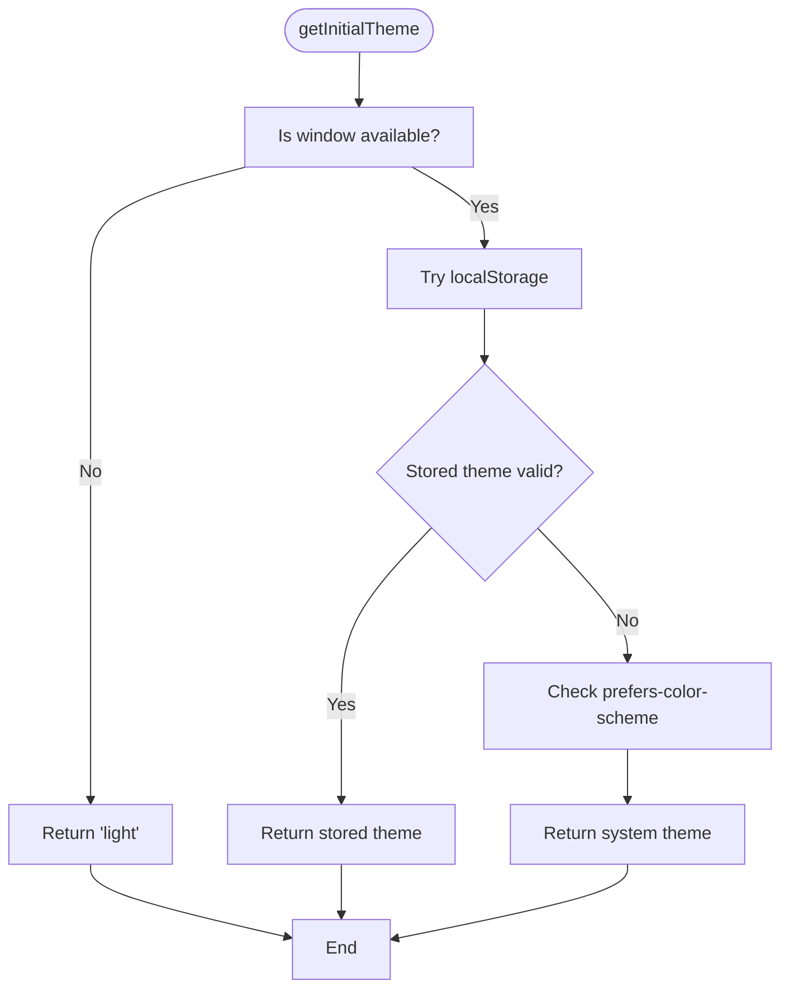
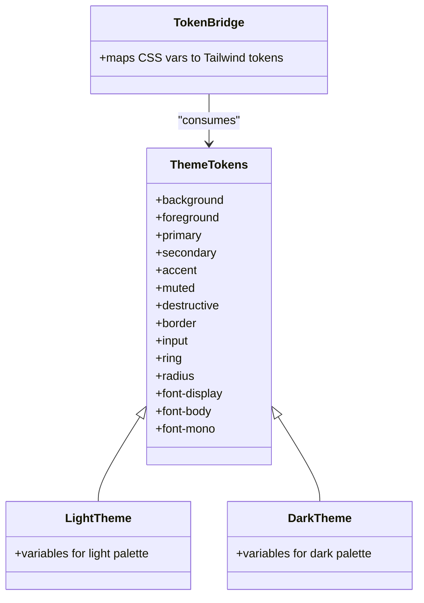
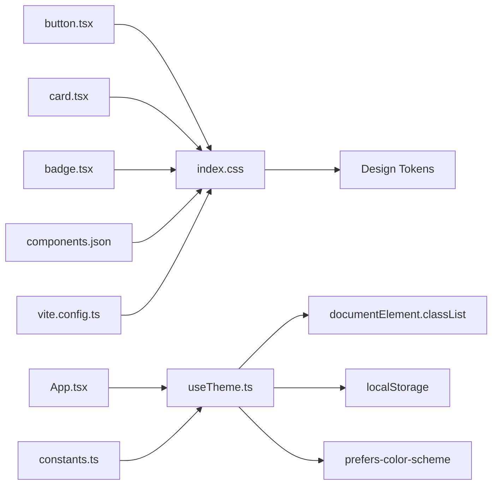

# Theme Management System

<cite>
**Referenced Files in This Document**
- [useTheme.ts](file://src/hooks/useTheme.ts)
- [index.css](file://src/index.css)
- [constants.ts](file://src/lib/constants.ts)
- [App.tsx](file://src/App.tsx)
- [main.tsx](file://src/main.tsx)
- [button.tsx](file://src/components/ui/button.tsx)
- [card.tsx](file://src/components/ui/card.tsx)
- [badge.tsx](file://src/components/ui/badge.tsx)
- [components.json](file://components.json)
- [package.json](file://package.json)
- [vite.config.ts](file://vite.config.ts)
</cite>

## Table of Contents
1. [Introduction](#introduction)
2. [Project Structure](#project-structure)
3. [Core Components](#core-components)
4. [Architecture Overview](#architecture-overview)
5. [Detailed Component Analysis](#detailed-component-analysis)
6. [Dependency Analysis](#dependency-analysis)
7. [Performance Considerations](#performance-considerations)
8. [Troubleshooting Guide](#troubleshooting-guide)
9. [Conclusion](#conclusion)
10. [Appendices](#appendices)

## Introduction
This document explains RedRep's theme management system with a focus on dynamic light/dark mode, theme persistence, and CSS custom property-driven styling. The system centers around a React hook that manages theme state, persists user preferences to localStorage, respects system preferences, and synchronizes theme changes across components using CSS custom properties. It integrates seamlessly with design tokens and Tailwind v4's token bridge to enable smooth transitions and consistent styling updates.

## Project Structure
The theme system spans several key areas:
- Centralized theme hook for state management and persistence
- CSS custom property definitions for design tokens and theme-aware utilities
- UI components that consume design tokens via CSS variables
- Application integration that exposes a theme toggle and renders design system previews

**Diagram sources**
- [App.tsx:1-139](file://src/App.tsx#L1-L139)
- [useTheme.ts:1-70](file://src/hooks/useTheme.ts#L1-L70)
- [index.css:1-402](file://src/index.css#L1-L402)
- [button.tsx:1-59](file://src/components/ui/button.tsx#L1-L59)
- [card.tsx:1-104](file://src/components/ui/card.tsx#L1-L104)
- [badge.tsx:1-53](file://src/components/ui/badge.tsx#L1-L53)
- [constants.ts:75-85](file://src/lib/constants.ts#L75-L85)
- [components.json:1-26](file://components.json#L1-L26)
- [vite.config.ts:1-15](file://vite.config.ts#L1-L15)

**Section sources**
- [useTheme.ts:1-70](file://src/hooks/useTheme.ts#L1-L70)
- [index.css:1-402](file://src/index.css#L1-L402)
- [App.tsx:1-139](file://src/App.tsx#L1-L139)
- [constants.ts:75-85](file://src/lib/constants.ts#L75-L85)
- [components.json:1-26](file://components.json#L1-L26)
- [vite.config.ts:1-15](file://vite.config.ts#L1-L15)

## Core Components
- Centralized theme hook: Provides theme state, programmatic switching, and system preference synchronization with localStorage persistence.
- CSS custom property system: Defines design tokens and theme-aware utilities for surfaces, accents, typography, and animations.
- UI components: Consume design tokens via CSS variables and adapt to theme changes automatically.
- Application integration: Exposes a theme toggle and showcases design system elements.

Key implementation highlights:
- Theme detection respects system preferences while allowing user override.
- Persistence uses localStorage with graceful fallback for unsupported environments.
- CSS variables update immediately, enabling smooth transitions without re-renders.
- Tailwind v4 token bridge maps CSS variables to design tokens for consistent styling.

**Section sources**
- [useTheme.ts:6-17](file://src/hooks/useTheme.ts#L6-L17)
- [useTheme.ts:19-69](file://src/hooks/useTheme.ts#L19-L69)
- [index.css:10-89](file://src/index.css#L10-L89)
- [index.css:94-192](file://src/index.css#L94-L192)
- [button.tsx:6-41](file://src/components/ui/button.tsx#L6-L41)
- [card.tsx:5-21](file://src/components/ui/card.tsx#L5-L21)
- [badge.tsx:7-28](file://src/components/ui/badge.tsx#L7-L28)
- [App.tsx:8-24](file://src/App.tsx#L8-L24)

## Architecture Overview
The theme system follows a unidirectional data flow:
- Initial theme selection is derived from localStorage or system preferences.
- User actions trigger theme updates that modify the document element class and persist the choice.
- CSS custom properties update instantly, causing components to re-render only when necessary.
- System preference changes are observed and applied only when the user has not set a preference.

**Diagram sources**
- [App.tsx:8-24](file://src/App.tsx#L8-L24)
- [useTheme.ts:19-41](file://src/hooks/useTheme.ts#L19-L41)
- [useTheme.ts:22-37](file://src/hooks/useTheme.ts#L22-L37)
- [index.css:94-192](file://src/index.css#L94-L192)

## Detailed Component Analysis

### Centralized Theme Hook (useTheme)
The hook encapsulates:
- Initial theme resolution: checks localStorage, falls back to system preference.
- Programmatic theme setter: updates the document element class and persists the choice.
- Toggle convenience: switches between light and dark modes.
- System preference listener: auto-switches only when no user preference is stored.
- Memoized callbacks: prevents unnecessary re-renders.

**Diagram sources**
- [useTheme.ts:6-17](file://src/hooks/useTheme.ts#L6-L17)

Implementation details:
- Initial theme selection uses a pure function to avoid side effects during SSR.
- The setter toggles the "dark" class on the document element to activate dark mode styles.
- System preference listener ensures automatic updates when the user has not set a preference.
- localStorage operations are wrapped in try/catch blocks for robustness.

**Section sources**
- [useTheme.ts:6-17](file://src/hooks/useTheme.ts#L6-L17)
- [useTheme.ts:19-41](file://src/hooks/useTheme.ts#L19-L41)
- [useTheme.ts:53-66](file://src/hooks/useTheme.ts#L53-L66)
- [constants.ts:82-84](file://src/lib/constants.ts#L82-L84)

### CSS Custom Property System
The stylesheet defines:
- Token bridge: maps CSS variables to Tailwind v4 design tokens.
- Light and dark themes: sets color palettes, typography, radii, and chart colors.
- Base layer: global resets and typography using CSS variables.
- Utilities: theme-aware gradients, glassmorphism, elevation, and animations.

Key characteristics:
- CSS variables drive all color and typography tokens.
- The ".dark" class switches between palettes.
- Tailwind v4 token bridge enables consistent design token usage across components.

**Diagram sources**
- [index.css:10-89](file://src/index.css#L10-L89)
- [index.css:94-192](file://src/index.css#L94-L192)

**Section sources**
- [index.css:10-89](file://src/index.css#L10-L89)
- [index.css:94-192](file://src/index.css#L94-L192)
- [index.css:197-280](file://src/index.css#L197-L280)
- [index.css:285-402](file://src/index.css#L285-L402)

### UI Components and Design Token Integration
Components rely on CSS variables for consistent theming:
- Button variants: use primary, secondary, muted, and destructive tokens with hover/focus states.
- Card: applies background, foreground, and ring tokens for surfaces and borders.
- Badge: adapts to theme-aware variants using primary and secondary tokens.

These components automatically reflect theme changes because they consume CSS variables rather than hardcoded values.

**Section sources**
- [button.tsx:6-41](file://src/components/ui/button.tsx#L6-L41)
- [card.tsx:5-21](file://src/components/ui/card.tsx#L5-L21)
- [badge.tsx:7-28](file://src/components/ui/badge.tsx#L7-L28)

### Application Integration and Theme Toggle
The application demonstrates:
- A floating theme toggle button that calls the hook's toggle function.
- A hero section with gradient mesh and grain overlay that adapt to theme.
- A design system preview showcasing color palettes, typography, and component samples.

The toggle button uses an accessible aria-label and toggles between sun/moon icons based on the current theme.

**Section sources**
- [App.tsx:8-24](file://src/App.tsx#L8-L24)
- [App.tsx:26-44](file://src/App.tsx#L26-L44)
- [App.tsx:46-128](file://src/App.tsx#L46-L128)

## Dependency Analysis
The theme system depends on:
- React hooks for state management and lifecycle events.
- localStorage for persistence.
- Tailwind v4 and CSS custom properties for design token mapping.
- UI components that consume CSS variables.

**Diagram sources**
- [useTheme.ts:19-69](file://src/hooks/useTheme.ts#L19-L69)
- [index.css:10-89](file://src/index.css#L10-L89)
- [button.tsx:1-59](file://src/components/ui/button.tsx#L1-L59)
- [card.tsx:1-104](file://src/components/ui/card.tsx#L1-L104)
- [badge.tsx:1-53](file://src/components/ui/badge.tsx#L1-L53)
- [App.tsx:1-139](file://src/App.tsx#L1-L139)
- [constants.ts:75-85](file://src/lib/constants.ts#L75-L85)
- [components.json:1-26](file://components.json#L1-L26)
- [vite.config.ts:1-15](file://vite.config.ts#L1-L15)

**Section sources**
- [useTheme.ts:19-69](file://src/hooks/useTheme.ts#L19-L69)
- [index.css:10-89](file://src/index.css#L10-L89)
- [button.tsx:1-59](file://src/components/ui/button.tsx#L1-L59)
- [card.tsx:1-104](file://src/components/ui/card.tsx#L1-L104)
- [badge.tsx:1-53](file://src/components/ui/badge.tsx#L1-L53)
- [App.tsx:1-139](file://src/App.tsx#L1-L139)
- [constants.ts:75-85](file://src/lib/constants.ts#L75-L85)
- [components.json:1-26](file://components.json#L1-L26)
- [vite.config.ts:1-15](file://vite.config.ts#L1-L15)

## Performance Considerations
- CSS variable updates are instantaneous and do not trigger React re-renders, minimizing layout thrashing.
- Memoized callbacks in the hook prevent unnecessary component re-renders when toggling themes.
- System preference listener is attached once and cleaned up on unmount.
- Tailwind v4 token bridge reduces runtime computation by mapping CSS variables directly to design tokens.
- Reduced motion support ensures animations are minimized for accessibility.

[No sources needed since this section provides general guidance]

## Troubleshooting Guide
Common issues and resolutions:
- Theme does not persist across browser sessions:
  - Verify localStorage availability and permissions.
  - Confirm the theme key matches the configured constant.
- Theme does not switch when system preference changes:
  - Ensure the user has not set a preference (localStorage entry).
  - Confirm the media query listener is active.
- Components do not reflect theme changes:
  - Verify CSS variables are defined and mapped via the token bridge.
  - Ensure components consume CSS variables rather than hardcoded values.
- Fallback behavior on unsupported browsers:
  - The initial theme defaults to light when window is undefined or localStorage is unavailable.

**Section sources**
- [useTheme.ts:6-17](file://src/hooks/useTheme.ts#L6-L17)
- [useTheme.ts:53-66](file://src/hooks/useTheme.ts#L53-L66)
- [constants.ts:82-84](file://src/lib/constants.ts#L82-L84)

## Conclusion
RedRep's theme management system provides a robust, performant, and accessible solution for dynamic light/dark mode. By centralizing state management in a React hook, persisting user preferences to localStorage, and leveraging CSS custom properties with Tailwind v4 token bridge, the system achieves seamless theme transitions and consistent design token usage across components. The architecture supports customization, extensibility, and graceful fallbacks for diverse environments.

[No sources needed since this section summarizes without analyzing specific files]

## Appendices

### Adding Custom Themes
To add a new theme variant:
1. Define CSS variables for the new theme in the stylesheet.
2. Extend the theme type and initial theme resolution logic in the hook.
3. Add a programmatic setter and toggle logic to the hook.
4. Ensure the UI components consume CSS variables so they adapt automatically.

Integration steps:
- Update the CSS custom property definitions for the new theme.
- Modify the hook to include the new theme option and persistence logic.
- Test theme switching and persistence across browser sessions.

**Section sources**
- [index.css:10-89](file://src/index.css#L10-L89)
- [index.css:94-192](file://src/index.css#L94-L192)
- [useTheme.ts:4-5](file://src/hooks/useTheme.ts#L4-L5)
- [useTheme.ts:6-17](file://src/hooks/useTheme.ts#L6-L17)
- [useTheme.ts:19-41](file://src/hooks/useTheme.ts#L19-L41)

### Programmatic Theme Switching
Programmatic switching can be performed by calling the hook's setter function with the desired theme. This updates the document element class and persists the preference to localStorage.

Example usage:
- Call the setter with "light" or "dark".
- Observe immediate CSS variable updates across the application.

**Section sources**
- [useTheme.ts:22-37](file://src/hooks/useTheme.ts#L22-L37)

### Integration with External Theme Providers
The system can be adapted to integrate with external providers by:
- Wrapping the existing hook with a provider that supplies theme state externally.
- Ensuring the provider passes theme state and setter to components.
- Maintaining CSS variable updates and persistence behavior.

Configuration considerations:
- Align the provider's theme key with the configured constant.
- Preserve the system preference listener behavior when integrating.

**Section sources**
- [constants.ts:82-84](file://src/lib/constants.ts#L82-L84)
- [useTheme.ts:53-66](file://src/hooks/useTheme.ts#L53-L66)

### CSS Variable Updates and Re-render Optimization
- CSS variable updates occur at the DOM level and do not trigger React re-renders.
- Components that rely on CSS variables remain stable during theme changes.
- Memoization in the hook prevents unnecessary re-renders during toggling.

**Section sources**
- [index.css:10-89](file://src/index.css#L10-L89)
- [useTheme.ts:39-41](file://src/hooks/useTheme.ts#L39-L41)